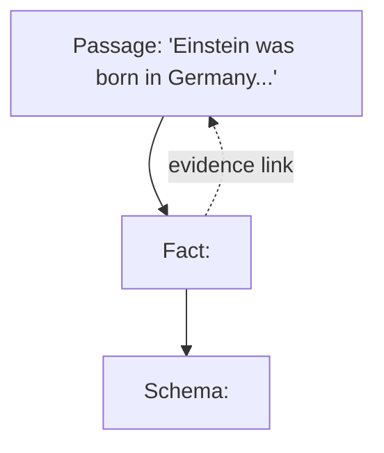

Act II converts prose into a city. Long before anyone said "GraphRAG," people wanted to hold knowledge in a machine-readable web — the semantic web, ontology languages, RDF, Cyc, WordNet — decades of effort to capture that knowledge is not a heap of sentences but an interconnected, hierarchical fabric. You have seen a knowledge graph in action even without naming it: search for the Taj Mahal and a tidy box opens beside the results with its core facts, served from Google's Knowledge Graph. Wikidata is the great open sibling of the same idea.

The form the field settled on is disarmingly simple: a knowledge graph is a bag of triplets,

$$G = \{T_i\}, \qquad T_i = \langle \text{head}, \text{relationship}, \text{tail} \rangle$$

$\langle \text{Einstein}, \text{born-in}, \text{Germany} \rangle$: two entities bound by one relational fact. Collect enough triplets and they knit themselves into a graph without being asked — Einstein was not merely born: he won a Nobel prize, created a theory, corresponded with half of physics, and many other people share the edge *born-in Germany*. Every vertex sprouts edges; the edges tangle; the bag becomes a web. Why triplets and not quadruplets? Because the destination is a graph — an edge joins two vertices, so a relation binds two things, head and tail, with the relation riding on the edge. The arity is the price of admission to every theorem from Act I.

## Fact triplets and the types that stand behind them

Alongside the fact triplet lives a second kind, the **ontological (schema) triplet** — which speaks not of specific entities but of categories, of types:

$$\langle \text{Einstein}, \text{born-in}, \text{Germany} \rangle \;\rightsquigarrow\; \langle \text{person}, \text{born-in}, \text{country} \rangle$$

Every fact can be generalized. The lifting operation is captured by a **typing function**

$$\phi(e) = t$$

mapping each entity $e$ to its type $t$: $\phi(\text{Einstein}) = \text{person}$, $\phi(\text{Germany}) = \text{country}$. One schema gathers under itself a wide family of facts — thousands of people were born in hundreds of countries, and all of those facts file under one ontological pattern. Facts are isolated and scattered; the types beneath them are the invisible glue. (The instinct is old: the Samkhya school held that if a thing belonged to no category, we could not recognize it at all — recognition is categorization, twenty-five centuries before $\phi$ got its notation.)

## Three altitudes at once

The payoff is a three-layer reading of any corpus — the picture to hold for the rest of the day:

| Layer | Contains | Example |
|---|---|---|
| **Passages** | the raw text — what Weeks 1–4 retrieved over | "Einstein was born in Germany. He lived..." |
| **Facts** | specific entities and their specific relationships | $\langle \text{Einstein}, \text{born-in}, \text{Germany} \rangle$ |
| **Schemas** | the types and typed relationships, the ontological skeleton | $\langle \text{person}, \text{born-in}, \text{country} \rangle$ |

Passages ground facts; facts instantiate schemas; schemas gather facts; facts point home to passages. Three worlds, connected by construction.



```python
# a typing function phi, applied to a handful of fact triplets
facts = [("Einstein", "born-in", "Germany"),
         ("Einstein", "won", "Nobel Prize"),
         ("Kaju", "is-a", "dog")]

phi = {"Einstein": "person", "Germany": "country",
       "Nobel Prize": "prize", "Kaju": "dog"}

for head, rel, tail in facts:
    schema = (phi[head], rel, phi[tail])
    print(f"{(head, rel, tail)} -> {schema}")
# ('Einstein', 'born-in', 'Germany') -> ('person', 'born-in', 'country')
```

> **The one thing to remember.** MemGraphRAG lives entirely inside this three-layer picture, so park it somewhere safe: passages ground facts, facts instantiate schemas, and every retrieval trick this afternoon is really a question about which of these three layers to trust.
