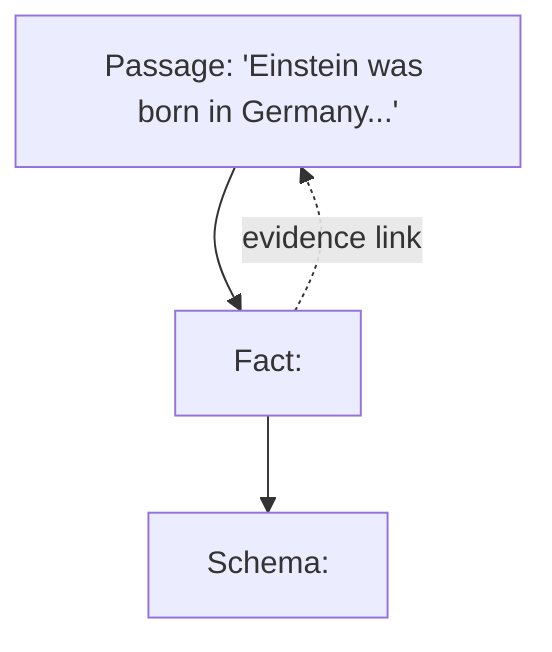

Act II converts prose into a city. Long before anyone said "GraphRAG," people wanted to hold knowledge in a machine-readable web — the semantic web, ontology languages, RDF, Cyc, WordNet — decades of effort to capture that knowledge is not a heap of sentences but an interconnected, hierarchical fabric. You have seen a knowledge graph in action even without naming it: search for the Taj Mahal and a tidy box opens beside the results with its core facts, served from Google's Knowledge Graph. Wikidata is the great open sibling of the same idea.

## Core intuition

A knowledge graph is a structured way to represent facts as relationships between entities. The key idea is that meaning lives not only in isolated statements, but in the edges that tie them together.

## Why it matters

The graph is the object that connects facts into a web, and that structure is exactly what makes multi-hop reasoning and global retrieval possible.

## Instructor framing

The three-layer table (passages, facts, schemas) is the single most important artifact on this page — everything from this point through MemGraphRAG is, in some sense, a question about which of these three layers a given retrieval trick is operating on. Have students practice classifying: is a given technique working with raw text, with specific entity-relation facts, or with the typed schema pattern behind those facts? That classification skill transfers directly to reading any future GraphRAG paper.

## Worked example

Take a corpus of pharmaceutical trial reports. A passage reads "Compound X showed a 12% reduction in tumor size in Phase II trials sponsored by Acme Pharma." The fact triplet extracted is $\langle \text{Compound X}, \text{reduces}, \text{tumor size} \rangle$ (with the passage kept as its evidence link). The schema triplet generalizes this to $\langle \text{drug}, \text{reduces}, \text{clinical-outcome} \rangle$ — a pattern shared by thousands of other facts across the corpus (aspirin reduces fever, statins reduce cholesterol). A query like "what drugs reduce tumor size" can match the fact layer directly; a query like "what kinds of relationships exist between drugs and outcomes in this corpus" can only be answered by querying the schema layer — no amount of searching individual facts would reveal that pattern, because the pattern lives one level of abstraction above any single fact.

This is the transition from raw text to machine-readable meaning. A fact triplet is the smallest reusable relationship object, and type information gives it a schema.


This is the transition from raw text to machine-readable meaning. A fact triplet is the smallest reusable relationship object, and type information gives it a schema.

The form the field settled on is disarmingly simple: a knowledge graph is a bag of triplets,

$$G = \{T_i\}, \qquad T_i = \langle \text{head}, \text{relationship}, \text{tail} \rangle$$

$\langle \text{Einstein}, \text{born-in}, \text{Germany} \rangle$: two entities bound by one relational fact. Collect enough triplets and they knit themselves into a graph without being asked — Einstein was not merely born: he won a Nobel prize, created a theory, corresponded with half of physics, and many other people share the edge *born-in Germany*. Every vertex sprouts edges; the edges tangle; the bag becomes a web. Why triplets and not quadruplets? Because the destination is a graph — an edge joins two vertices, so a relation binds two things, head and tail, with the relation riding on the edge. The arity is the price of admission to every theorem from Act I.

## Fact triplets and the types that stand behind them

Alongside the fact triplet lives a second kind, the **ontological (schema) triplet** — which speaks not of specific entities but of categories, of types:

$$\langle \text{Einstein}, \text{born-in}, \text{Germany} \rangle \;\rightsquigarrow\; \langle \text{person}, \text{born-in}, \text{country} \rangle$$

Every fact can be generalized. The lifting operation is captured by a **typing function**

$$\phi(e) = t$$

mapping each entity $e$ to its type $t$: $\phi(\text{Einstein}) = \text{person}$, $\phi(\text{Germany}) = \text{country}$. One schema gathers under itself a wide family of facts — thousands of people were born in hundreds of countries, and all of those facts file under one ontological pattern. Facts are isolated and scattered; the types beneath them are the invisible glue. (The instinct is old: the Samkhya school held that if a thing belonged to no category, we could not recognize it at all — recognition is categorization, twenty-five centuries before $\phi$ got its notation.)

## Three altitudes at once

The payoff is a three-layer reading of any corpus — the picture to hold for the rest of the day:

| Layer | Contains | Example |
|---|---|---|
| **Passages** | the raw text — what Weeks 1–4 retrieved over | "Einstein was born in Germany. He lived..." |
| **Facts** | specific entities and their specific relationships | $\langle \text{Einstein}, \text{born-in}, \text{Germany} \rangle$ |
| **Schemas** | the types and typed relationships, the ontological skeleton | $\langle \text{person}, \text{born-in}, \text{country} \rangle$ |

Passages ground facts; facts instantiate schemas; schemas gather facts; facts point home to passages. Three worlds, connected by construction.



```python
# a typing function phi, applied to a handful of fact triplets
facts = [("Einstein", "born-in", "Germany"),
         ("Einstein", "won", "Nobel Prize"),
         ("Kaju", "is-a", "dog")]

phi = {"Einstein": "person", "Germany": "country",
       "Nobel Prize": "prize", "Kaju": "dog"}

for head, rel, tail in facts:
    schema = (phi[head], rel, phi[tail])
    print(f"{(head, rel, tail)} -> {schema}")
# ('Einstein', 'born-in', 'Germany') -> ('person', 'born-in', 'country')
```

> **The one thing to remember.** MemGraphRAG lives entirely inside this three-layer picture, so park it somewhere safe: passages ground facts, facts instantiate schemas, and every retrieval trick this afternoon is really a question about which of these three layers to trust.


## Math explained step by step

Walk through why triplets, specifically, and not some richer structure, are the right unit — and what the typing function $\phi$ actually buys you.

**Step 1 — see why arity two (head, tail) matches the graph formalism exactly.** Week 5's opening page defined a graph as $G=(V,E)$ with $E \subseteq V \times V$ — an edge is a *pair* of vertices. A triplet $\langle \text{head}, \text{relation}, \text{tail}\rangle$ maps directly onto this: head and tail become the two vertices of an edge, and the relation becomes the edge's label. A "quadruplet" (head, relation, tail, plus some fourth argument) would have nowhere to live in this formalism without inventing a new kind of hyperedge — so every algorithm from Act I (degree, modularity, the Laplacian) would need re-deriving, at real cost, for no clearly stated benefit.

**Step 2 — see the typing function as a many-to-one map that creates leverage.** $\phi(e) = t$ sends potentially millions of distinct entities to a much smaller set of types — every person, regardless of which specific person, maps to "person." This many-to-one structure is exactly what allows one schema triplet to summarize an enormous number of fact triplets: $\phi$ compresses the entity space the same way pooling compressed a sequence of tokens into one chunk vector (Week 2), trading individual identity for a shared, generalizable pattern.

**Step 3 — see why generalization requires this compression.** Without $\phi$, "Einstein was born in Germany" and "Marie Curie was born in Poland" are two unrelated facts with no formal connection. Applying $\phi$ to both reveals they instantiate the identical schema $\langle\text{person}, \text{born-in}, \text{country}\rangle$ — a pattern invisible at the fact layer and only visible once entities are lifted to their types. This is the formal mechanism behind "thousands of facts file under one ontological pattern."

**Step 4 — see how the three layers connect computationally, not just conceptually.** A fact triplet's provenance link back to its source passage means you can always answer "why do you believe this?" by pointing at text (fact $\to$ passage). A fact's application of $\phi$ means you can always answer "what kind of fact is this?" by pointing at its schema (fact $\to$ schema). Neither direction requires re-deriving anything — the triplet structure makes both queries a simple lookup, which is precisely why this representation, and not free-form text, supports the multi-hop and schema-level reasoning the rest of the week builds on.

## Practical pattern

When designing a knowledge-graph extraction pipeline for a real corpus:

1. decide your entity type taxonomy ($\phi$'s target set) deliberately and early — too coarse (only "thing") loses useful generalization, too fine (a unique type per entity) defeats the point of typing at all; aim for a taxonomy with a few dozen to a few hundred types for most enterprise domains;
2. always store the fact-to-passage evidence link (the dotted line in the diagram) — without it, a fact triplet is an unverifiable assertion, and the core pattern from Week 4 (generate from source, never from the derivative alone) requires this link to function for graph-derived facts too;
3. build or reuse the schema layer explicitly rather than leaving it implicit — an explicit schema layer lets you query "what relationship types exist between drugs and outcomes in this corpus," a question the fact layer alone cannot answer no matter how thoroughly you search it.

## Common traps

- extracting fact triplets without a typing function, then discovering later that there's no way to ask schema-level questions ("what kinds of relationships exist here") without re-processing the entire corpus;
- choosing an entity type taxonomy that is either too coarse (everything is "thing" or "entity," destroying discriminative power) or too fine (every entity gets a unique type, destroying the generalization the schema layer exists to provide);
- dropping the fact-to-passage evidence link to save storage, then being unable to verify or cite a graph-derived fact when a user or auditor asks for its source;
- treating the three-layer picture as a one-time design decision rather than an ongoing discipline — as new documents are ingested, new facts must be correctly typed and linked, or the three layers drift out of sync.

## Takeaways

- A knowledge graph is a bag of head-relation-tail fact triplets, and every fact triplet has an implicit schema triplet behind it, created by lifting entities to their types via a typing function $\phi$.
- The three-layer reading (passages ground facts, facts instantiate schemas) is the organizing picture for the rest of the week — most later GraphRAG techniques are really about which layer to trust or query.
- Concretely: always store the fact-to-passage evidence link at extraction time — it is what lets a graph-derived answer be verified and cited back to its source, exactly as Week 4's core pattern requires for any derivative artifact.
