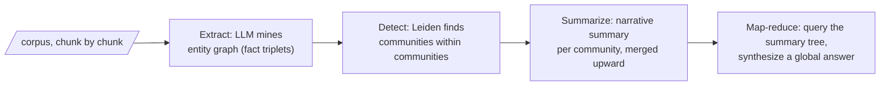

"GraphRAG" is one of those names that has meant more things than any name should be asked to mean. Act III is a walking tour with two long stops — pausing first at the oldest meaning, then settling in at Microsoft GraphRAG.

## The oldest meaning: neighbor expansion

Years before the current wave, "graph RAG" meant something modest: keep a knowledge graph on the side, and at query time use it to expand the query. Extract the entities the user mentioned; find them in the graph; walk one or two hops; collect the neighboring terms and relations; append them to the query (or stuff them into the context) and run retrieval as usual.

It is genuinely useful for the right question. Multi-hop factual queries — "who is the CEO of the company that acquired X?" — need exactly a relational bridge that embedding similarity does not supply, and a two-hop walk supplies it. But mark its character: it is **local**. It begins at the query's entities and explores their vicinity; it never sees the graph's large-scale structure, because no walk of two hops sees a continent. And here is the morning's hub warning, cashed in: neighbor expansion degrades precisely because real graphs are scale-free. Walk two hops from any entity of interest and you will, with high probability, pass through a hub — and a hub's neighborhood is *everything*. The expansion floods with generic noise exactly when the graph is large enough to be interesting.

## Microsoft GraphRAG: harvesting the emergence

In 2024, Microsoft Research published "From Local to Global" — a title that is a thesis. Its question: what about queries that are not in any passage — global sensemaking queries (query-focused summarization)? Ask a novel: *what are its underlying leitmotifs?* No chunk says the theme; embedding similarity pulls up nothing useful, because themes are emergent and passages are local. Every architecture of Weeks 1–4 is structurally incapable of answering, because the answer is a property of the whole, not of any part.

The pipeline, end to end, in four movements:

**Extract.** An LLM sweeps the corpus, extracting entities and relationships — fact triplets, in Act II's vocabulary — merged into one corpus-level entity graph. Entity resolution ("FDA" vs. "Food and Drug Administration") is unglamorous and load-bearing: resolve poorly and the graph fragments.

**Detect.** Run **Leiden** — the circled name from Act I, exactly that algorithm, optimizing exactly the modularity $Q$ — over the entity graph. Out comes the hierarchy the morning promised: communities within communities, two to four meaningful levels.

**Summarize.** Write a narrative summary of each leaf community — what entities it contains, how they relate, what theme emerges — then merge leaf summaries into parent-community summaries, up the hierarchy. A community summary is a derivative artifact (Week 4's vocabulary) whose subject is a piece of the corpus's *structure*.

**Map–reduce.** At query time, a global question is put to the community summaries (map: "what does this community say about it?"), and the partial answers are synthesized (reduce) into one global response.

Suppose the corpus is two thousand physics papers, and Leiden finds a dense community whose entities are entropy, the second law, Carnot cycle, Boltzmann distribution. Its summary is, in effect, *the definitive textbook chapter on thermodynamics as this corpus would write it* — last week's "definitive article" idea, rebuilt on relational density instead of embedding proximity. RAPTOR gathers passages that sound alike; GraphRAG gathers entities that interact.

## The invoice

And now the bill arrives. Handed a single public-domain novel and an OpenAI key "for a few LLM calls," a summer intern ran Microsoft's GraphRAG code on it overnight — and the next morning the bill was close to a thousand dollars, for one book. Scale to an enterprise corpus and the problem is visible with your own eyes: extraction is an LLM call per chunk; community detection is cheap by comparison but not free; and then leaf summaries, merged summaries, summaries of summaries — LLM calls all the way up the hierarchy. When the corpus changes, the graph and summaries rot, and the meter starts again.

> **The one thing to remember.** Every architectural choice in the successor systems (next page) is an answer to this invoice. When personalized PageRank shows up later and you wonder why anyone bothered, remember the thousand-dollar book.
