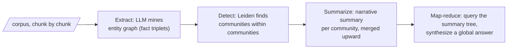

"GraphRAG" is one of those names that has meant more things than any name should be asked to mean. Act III is a walking tour with two long stops — pausing first at the oldest meaning, then settling in at Microsoft GraphRAG.

## Core intuition

There are at least three distinct meanings of GraphRAG: local expansion around entities, global cluster summarization, and diffusion-based retrieval over the graph. They solve different classes of query and come with different costs.

## Why it matters

The same phrase hides very different architectures. A local neighbor expansion is a retrieval trick; a community-summarization GraphRAG is a corpus-level synthesis system; a diffusion-based retrieval system is a graph algorithm wearing a retrieval interface.

## Instructor framing

The thousand-dollar-book anecdote is not a throwaway joke — it should be treated as the cost baseline against which every later system in Weeks 5-6 is measured. When a future page introduces a cheaper alternative, the natural instructor move is to ask the class to predict, before reading further, which of the four pipeline stages (extract, detect, summarize, map-reduce) the cheaper system is attacking, and why that stage was the expensive one here.

## Worked example

Consider a compliance corpus and the query "which regulator's ruling forced the divestiture that preceded Acme's acquisition of Beta Corp?" A dense-retrieval-only system finds passages mentioning Acme, Beta Corp, and "acquisition," but the actual chain of causation — ruling → divestiture → acquisition — is relational, not lexical, and no single passage states all three links. Neighbor expansion starts at the entities "Acme" and "Beta Corp," walks two hops through the graph, and surfaces the connecting "divestiture" and "ruling" nodes directly — exactly the kind of multi-hop bridge embedding similarity cannot supply. Now compare a different query on the same corpus: "what are the recurring regulatory themes across all the merger cases in this corpus?" No two-hop walk from any specific entity answers this — the answer is a property of the entire graph's community structure, which is precisely the query Microsoft GraphRAG's community summarization was built to answer and neighbor expansion cannot reach.

This chapter is about naming the different GraphRAGs so they stop being confused with one another. The architecture depends on the question being asked.

## The oldest meaning: neighbor expansion

Years before the current wave, "graph RAG" meant something modest: keep a knowledge graph on the side, and at query time use it to expand the query. Extract the entities the user mentioned; find them in the graph; walk one or two hops; collect the neighboring terms and relations; append them to the query (or stuff them into the context) and run retrieval as usual.

It is genuinely useful for the right question. Multi-hop factual queries — "who is the CEO of the company that acquired X?" — need exactly a relational bridge that embedding similarity does not supply, and a two-hop walk supplies it. But mark its character: it is **local**. It begins at the query's entities and explores their vicinity; it never sees the graph's large-scale structure, because no walk of two hops sees a continent. And here is the morning's hub warning, cashed in: neighbor expansion degrades precisely because real graphs are scale-free. Walk two hops from any entity of interest and you will, with high probability, pass through a hub — and a hub's neighborhood is *everything*. The expansion floods with generic noise exactly when the graph is large enough to be interesting.

## Microsoft GraphRAG: harvesting the emergence

In 2024, Microsoft Research published "From Local to Global" — a title that is a thesis. Its question: what about queries that are not in any passage — global sensemaking queries (query-focused summarization)? Ask a novel: *what are its underlying leitmotifs?* No chunk says the theme; embedding similarity pulls up nothing useful, because themes are emergent and passages are local. Every architecture of Weeks 1–4 is structurally incapable of answering, because the answer is a property of the whole, not of any part.

The pipeline, end to end, in four movements:

**Extract.** An LLM sweeps the corpus, extracting entities and relationships — fact triplets, in Act II's vocabulary — merged into one corpus-level entity graph. Entity resolution ("FDA" vs. "Food and Drug Administration") is unglamorous and load-bearing: resolve poorly and the graph fragments.

**Detect.** Run **Leiden** — the circled name from Act I, exactly that algorithm, optimizing exactly the modularity $Q$ — over the entity graph. Out comes the hierarchy the morning promised: communities within communities, two to four meaningful levels.

**Summarize.** Write a narrative summary of each leaf community — what entities it contains, how they relate, what theme emerges — then merge leaf summaries into parent-community summaries, up the hierarchy. A community summary is a derivative artifact (Week 4's vocabulary) whose subject is a piece of the corpus's *structure*.

**Map–reduce.** At query time, a global question is put to the community summaries (map: "what does this community say about it?"), and the partial answers are synthesized (reduce) into one global response.

Suppose the corpus is two thousand physics papers, and Leiden finds a dense community whose entities are entropy, the second law, Carnot cycle, Boltzmann distribution. Its summary is, in effect, *the definitive textbook chapter on thermodynamics as this corpus would write it* — last week's "definitive article" idea, rebuilt on relational density instead of embedding proximity. RAPTOR gathers passages that sound alike; GraphRAG gathers entities that interact.

## The invoice

And now the bill arrives. Handed a single public-domain novel and an OpenAI key "for a few LLM calls," a summer intern ran Microsoft's GraphRAG code on it overnight — and the next morning the bill was close to a thousand dollars, for one book. Scale to an enterprise corpus and the problem is visible with your own eyes: extraction is an LLM call per chunk; community detection is cheap by comparison but not free; and then leaf summaries, merged summaries, summaries of summaries — LLM calls all the way up the hierarchy. When the corpus changes, the graph and summaries rot, and the meter starts again.

> **The one thing to remember.** Every architectural choice in the successor systems (next page) is an answer to this invoice. When personalized PageRank shows up later and you wonder why anyone bothered, remember the thousand-dollar book.

## Math explained step by step

Quantify why neighbor expansion "floods with generic noise exactly when the graph is large enough to be interesting."

**Step 1 — model expansion cost as a function of degree.** A one-hop expansion from vertex $v$ returns $k_v$ neighbors. A two-hop expansion returns, roughly, $\sum_{u \in N(v)} k_u$ neighbors (the neighbors of each of $v$'s neighbors) — the cost grows with the degrees of everything you touch along the way, not just the starting vertex.

**Step 2 — plug in the heavy-tailed degree distribution from Act I.** If even one of $v$'s neighbors is a generic-entity hub with degree in the thousands (as Week 5's previous page predicts must exist in any real extracted graph), the sum $\sum_{u\in N(v)} k_u$ is dominated entirely by that one term — the other, more specific neighbors contribute negligibly to the total by comparison.

**Step 3 — see why this makes the corpus size itself the enemy.** In a small graph, hub degree is bounded by the graph's size, so even a hub's neighborhood is manageable. As the corpus grows, preferential attachment keeps concentrating more edges onto the same hubs (Act I's rich-get-richer dynamic), so the hub's degree — and therefore the two-hop expansion's noise floor — grows faster than the graph's genuinely useful specific content does. This is precisely "degrades exactly when the graph is large enough to be interesting": the failure mode gets worse, not better, as you add more of the corpus.

**Step 4 — see why community summarization sidesteps this specific failure by construction.** Leiden's modularity optimization explicitly discounts expected hub connectivity ($k_ik_j/2m$) when assigning communities, so a generic hub tends to sit at the boundary between many communities rather than dominating any single one's summary. The map-reduce step then queries community summaries, not raw graph neighborhoods — so a hub's enormous degree never gets a chance to flood a single expansion step the way it does in neighbor expansion, at the cost of the extraction-detection-summarization pipeline's much higher upfront price (the thousand-dollar invoice).

## Practical pattern

Choosing between GraphRAG architectures for a real system:

1. use neighbor expansion when your query distribution is dominated by multi-hop *factual* questions with specific, identifiable entities ("who acquired the company that X sued") — it is cheap, fast, and exactly matched to this query shape;
2. add explicit hub suppression or degree-capping to any neighbor expansion implementation before deploying it — cap the number of neighbors explored per hop, or down-weight edges to entities above some degree threshold, rather than deploying a naive unbounded walk;
3. reserve full Microsoft GraphRAG (extract-detect-summarize-map-reduce) for genuinely global, thematic, sensemaking queries that no local expansion could answer — and budget explicitly for its cost, since it is an LLM call per chunk at extraction and per community at summarization, compounding at every level of the hierarchy;
4. before committing to either architecture in production, estimate the cost at your actual corpus scale (not a demo-sized sample) — the thousand-dollar single-book invoice is a warning that costs here do not scale gently, and a pilot on 1% of your corpus can badly underestimate the full run.

## Common traps

- deploying naive neighbor expansion without any hub suppression, then being surprised when a two-hop walk from a common entity returns what amounts to the whole graph;
- assuming Microsoft GraphRAG's community summarization is a strict upgrade over neighbor expansion, when it solves a different class of query (global/thematic) at a much higher cost, and neighbor expansion remains the better tool for local multi-hop factual questions;
- estimating Microsoft GraphRAG's cost from a small pilot corpus and extrapolating linearly, when extraction and hierarchical summarization costs can scale in ways that surprise teams who only tested at small scale;
- forgetting to re-run extraction and community detection as the corpus grows or changes — a stale graph and stale summaries silently drift out of sync with the actual corpus, "rotting" exactly as the page warns.

## Takeaways

- Neighbor expansion is a cheap, local technique well-suited to multi-hop factual queries with specific entities, but its cost grows explosively when a walk passes through a generic-entity hub — a near-certainty in any real, growing graph.
- Microsoft GraphRAG's community-based approach answers a fundamentally different class of query (global, thematic sensemaking) that no local expansion can reach, at a real and often substantial cost.
- Concretely: match the architecture to the query class — neighbor expansion (with hub suppression) for local multi-hop facts, community summarization for global themes — and estimate costs at real corpus scale before committing to the more expensive pipeline.
