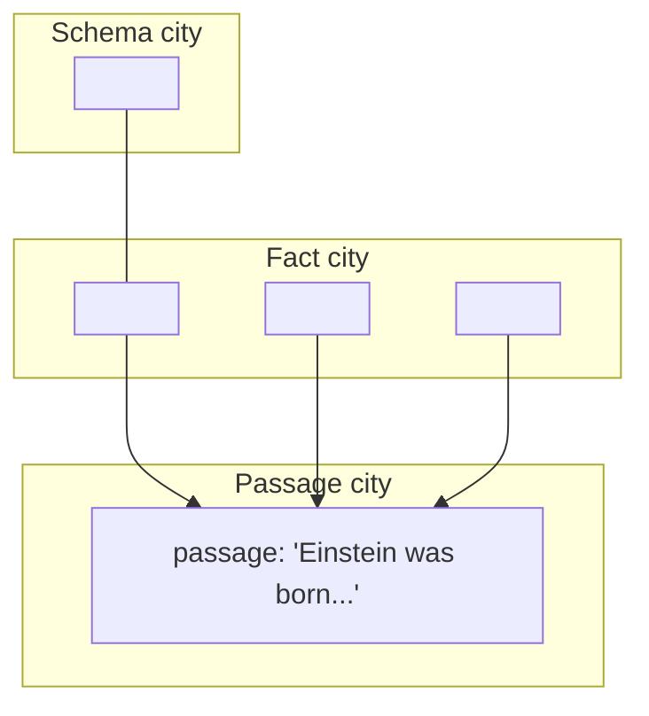

Suppose the graph is built — three worlds with connective tissue: passages $p$ at the bottom, facts over entities $e$ above them, schemas over types $t$ above those. A user hands you a query. How do you retrieve, with no communities and no summaries to lean on?

Embed everything. Write each triplet as plain text — "Einstein born in Germany" — and push it through a standard embedding model; embed the query too, call it $q$. Picture a night flight over three cities — a schema city, a fact city, a passage city — and the query is a wand waved over all three at once. Bulbs light up by relevance (cosine similarity): types glow, entities begin to shine, a passage or two gets excited.



## Three initializations, one per layer

**Entities.** Score an entity by the average similarity of its facts:

$$P_{init}(e) = \frac{1}{|F_e|} \sum_{f \in F_e} \text{Sim}(q, f)$$

The mean, not the sum, is deliberate: summing would hand runaway scores to entities mentioned in many facts — hubs — while the mean rewards relevance, not frequency of mention. A tiny example makes the point concrete. Say the query is about relativity. "Einstein" appears in three facts, with similarities $0.9$, $0.7$, $0.2$ to the query — mean $0.6$. "United States" is a generic hub appearing in a hundred facts, mostly irrelevant, with similarities averaging $0.05$ each. Summed, the hub would score $100 \times 0.05 = 5.0$ against Einstein's $0.9+0.7+0.2=1.8$ — the hub would win purely by being mentioned everywhere. Averaged, the hub scores $0.05$ against Einstein's $0.6$ — relevance wins, exactly as it should.

**Types.** Mirror-symmetric, with one extra factor — **hub suppression**:

$$P_{init}(t) = \frac{1}{|S_t|} \sum_{s \in S_t} \text{Sim}(q, s) \cdot \frac{1}{\log(\deg(t) + 1)}$$

A type like "person" has enormous degree, so it is muted, gently. The $+1$ spares you the logarithm of zero; the logarithm makes the muting mild. Concretely: "person" might have degree $10{,}000$ (it touches nearly every fact), giving a damper of $1/\log(10{,}001) \approx 1/9.2 \approx 0.109$; a rare type like "isotope" with degree $10$ gets $1/\log(11) \approx 1/2.4 \approx 0.417$ — about four times less suppressed, not thousands of times, because the *logarithm* of a huge degree is still a modest number. That gentleness is the point: a hub is discouraged, not disqualified. Barabási is this equation's uncredited co-author.

**Passages.** No averaging; the first term is the classic RAG score, then two twists:

$$P_{init}(p) = \alpha \, \text{Sim}(q, d_p) + \sigma\!\left(\frac{\sum_{e \in E_p} \text{IDF}(e)}{\log(|E_p| + 1)}\right), \qquad \alpha = 0.05$$

Direct query-to-passage similarity is discounted by ninety-five percent — deliberately undervalued relative to facts and schemas. Concretely: a passage with a strong direct match, $\text{Sim}(q, d_p) = 0.8$, contributes only $\alpha \times 0.8 = 0.05 \times 0.8 = 0.04$ to its score — almost nothing on its own. The second term is an IDF-weighted entity-density score, squashed through a sigmoid: a passage dense with rare, unfamiliar entities scores high; a passage mentioning only Einstein in a physics corpus does not.

## The honey and the springs: personalized PageRank

Concepts are related to concepts, and the graph knows things the individual scores do not — so one more phase runs: a redistribution, and it is **personalized PageRank**, the same machinery HippoRAG used.

Every cross-layer link enters a giant adjacency matrix $A$; from it, the transition matrix $W = D^{-1}A$ — split, don't dump: share along your edges in weighted proportion. Stack every initial score into one tall column vector $v^{(0)}$: a city's worth of lit bulbs — the paper calls this **semantic energy**. Then iterate:

$$v^{(k+1)} = (1 - \lambda) W v^{(k)} + \lambda v^{(0)}, \qquad \lambda = \frac{1}{2}$$

The seed nodes are springs, not a one-time pour: each round, every node lets half of what it holds flow outward to its neighbors, proportional to $W$; the other half re-injects the original query-seeded energy at the seeds. Traveling honey halves at every hop — so it glazes a one-or-two-hop neighborhood before the leash yanks it back. In one settled run, 52% of the energy stayed on the seed, 29% reached its neighbors, 16% the second hop — 97% within two hops.

```python
# personalized PageRank, toy version -- honey settling on a 4-node star + tail
import numpy as np

nodes = ["query_seed", "neighbor_1", "neighbor_2", "far_node"]
A = np.array([
    [0, 1, 1, 0],
    [1, 0, 0, 1],
    [1, 0, 0, 0],
    [0, 1, 0, 0],
], dtype=float)

D_inv = np.diag(1.0 / A.sum(axis=1))
W = D_inv @ A                      # transition matrix: split, don't dump

v0 = np.array([1.0, 0.0, 0.0, 0.0])  # all initial energy at the query seed
v = v0.copy()
lam = 0.5

for step in range(10):
    v = (1 - lam) * (W @ v) + lam * v0
    print(f"step {step+1}: {np.round(v, 3)}")
# energy settles fast -- error shrinks like (1-lambda)^k = 0.5^10 = 1/1024
```

The update is a contraction (Banach's fixed-point theorem): the error after $k$ rounds shrinks like $(1-\lambda)^k$; with $\lambda = 1/2$ and ten rounds, $(0.5)^{10} = 1/1024$. You do not iterate many times; you just stop. This is why the paper reports **0.061 seconds per retrieval** — against 1.6s for HippoRAG and 11s for LightRAG — answering the thousand-dollar Karamazov invoice in sixty milliseconds.

> **The one thing to remember.** Nobody ever walks the graph. You let the honey settle — ten sparse matrix–vector products — then skim the richest pools. This is diffusion with a restart, the Laplacian's smoothing from Act I, leashed and personalized.
