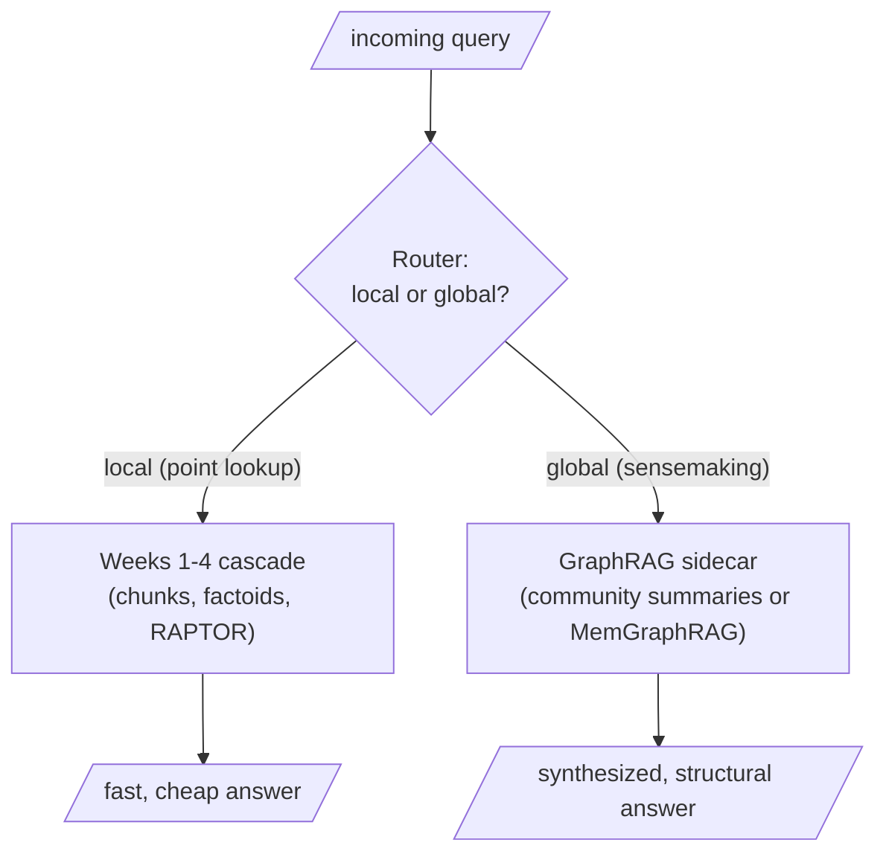

Papers from academia are great; the enterprise reads them through different lenses — economics, feasibility, scalability. This is the day's engineering verdict.

## Core intuition

GraphRAG is not a universal replacement for standard retrieval. It is an expensive specialized tool for a narrow but important class of tasks: global, corpus-level sensemaking.

## Why it matters

The real deployment question is whether the query is local or global. Local queries should stay on the standard chunk-and-rank path; global queries may deserve the graph sidecar.

## Instructor framing

This page is the week's landing point, and it should feel like a return to earth after two acts of increasingly sophisticated mathematics. Push students to actually classify a handful of realistic queries from their own capstone domain into local versus global before moving on — an abstract acceptance of "route by query type" is much weaker than having just done the routing exercise once by hand.

## Worked example

A legal-tech company deploys GraphRAG on their contract corpus. "What is the termination clause in the Acme vendor agreement?" is a point query — a router correctly sends it to the standard chunk-and-rank cascade, and it resolves in milliseconds against one document. "What are the most common indemnification structures across our top 50 vendor contracts, and how have they shifted over the past three years?" is a global sensemaking query — no single contract's chunk contains a cross-contract, cross-year trend, so it routes to the graph sidecar, where community summaries (or MemGraphRAG's settled energy) synthesize an answer that genuinely does not exist as text anywhere in the corpus. The company's mistake, before adopting the router, was building the graph over their entire multi-million-document contract archive "just in case" — the everything-graph anti-pattern — when in practice only the flagship vendor-contracts sub-corpus and roughly 8% of incoming queries ever needed it.

This is where the engineering judgment appears. The graph should be a sidecar, not the entire system, because route selection matters more than raw model power.


This is where the engineering judgment appears. The graph should be a sidecar, not the entire system, because route selection matters more than raw model power.

## The pattern: global sensemaking

GraphRAG approaches earn their keep on exactly one class of query: the query whose answer is a property of the corpus's structure, not of any passage in it. "What are the underlying leitmotifs of this novel?" "What are the major regulatory concerns across five hundred earnings calls?" "What are the dominant themes across everything our customers wrote us this quarter?" The signature is always the same: a human answering it would need to have read everything and formed a mental model — and the mental model *is* the entity graph with its communities. The community summaries (Microsoft) or the energy-settled subgraph (MemGraphRAG) are the only artifacts in your entire architecture that even contain the answer. Concretely: strategic dashboards fed by sensemaking queries, periodic corpus briefings, investigation and root-cause work where contradictions and bridges are precisely the gems, and hybrid answers combining the graph with Text2SQL and plain retrieval.

## The anti-patterns

| Anti-pattern | Why it fails |
|---|---|
| **The point query** — "What did the flood do to Tom and Maggie?" | A single passage answers it; routing through community summaries or a three-layer cascade is a telescope reading a wristwatch — slower, costlier, and often worse |
| **The small corpus** | Emergence needs mass. Run Leiden on fifteen entities and you get tiny "communities" whose summaries paraphrase the essay, at LLM prices. You cannot detect ocean currents in a bathtub |
| **The real-time chat lane** | Map–reduce is seconds-per-query; graph freshness is a batch concern. MemGraphRAG's sixty milliseconds helps, but construction cost and freshness burden remain |
| **The everything-graph** | The gravest one: shunting the whole corpus through graph construction because the demo was impressive |

## The sidecar: high-value documents, high-value queries

GraphRAG, in any variant, is always a **sidecar** — it extends the motorcycle; it never replaces it. It is expensive to build (an LLM call per chunk, then in the Microsoft lineage the summary pyramid, then forever the freshness tax) and expensive to serve unless you are Lazy (pay at query time) or Mem (paid at construction). So you route on two axes:

**High-value documents into the graph.** Not petabytes — select the sub-corpus whose global structure the organization actually needs to understand: the contracts, the filings, the research collection, the customer-voice corpus. The rest stays in the plain index, perfectly retrievable, unmapped.

**High-value queries through the graph.** A router classifies each query as local (point lookup) versus global (sensemaking), using the flood-question-versus-leitmotif-question litmus pair as its creed. The local majority flows through the standard cascade; the global minority — perhaps five to fifteen percent — is escorted to the sidecar. Those few are disproportionately the queries executives ask.



```python
# a toy router: classify by whether the query names a specific fact or asks for synthesis
GLOBAL_SIGNS = ["overall", "themes", "leitmotifs", "dominant", "across", "compare"]

def route(query: str) -> str:
    q = query.lower()
    if any(sign in q for sign in GLOBAL_SIGNS):
        return "sidecar (graph)"
    return "standard cascade"

print(route("What did Tom and Maggie's flood do?"))               # standard cascade
print(route("What are the dominant themes across the corpus?"))    # sidecar (graph)
```

Keep the ledger honest about quality, not just money. GraphRAG amplifies extraction quality: a noisy graph yields meaningless communities yields useless summaries. Entity resolution is load-bearing. And contradictions — if Critique B was taken seriously — are worth preserving in your graph as annotated, first-class edges, because in an enterprise the contradiction is often the single most valuable thing the graph will ever surface.

> **The one thing to remember.** The structure is real, the harvest is expensive, and the engineering art is knowing which queries deserve it. GraphRAG is a sidecar for high-value documents and high-value queries — never the whole motorcycle.


## Math explained step by step

Turn "GraphRAG earns its keep on 5-15% of queries" into an actual cost-benefit calculation, so the sidecar decision is a computation, not a guess.

**Step 1 — model the cost of routing every query through the graph.** If a standard cascade answer costs $c_s$ (cents, say) and a graph-sidecar answer costs $c_g$, with $c_g \gg c_s$ (Microsoft GraphRAG's per-book invoice versus a normal retrieval call makes this ratio enormous), then routing $N$ queries entirely through the graph costs $N \cdot c_g$ — the everything-graph anti-pattern's actual bill.

**Step 2 — model the cost of routing correctly.** If a fraction $f$ of queries are genuinely global (the paper's 5-15% estimate) and the rest are local, correct routing costs $N(1-f)c_s + Nf\,c_g$. Compare this to Step 1's $N c_g$: the savings ratio is $\frac{(1-f)c_s + f c_g}{c_g}$, which for small $f$ and $c_s \ll c_g$ is dominated by $(1-f)c_s/c_g$ — vanishingly small compared to routing everything through the graph. Concretely, at $f=0.1$ and $c_g/c_s = 1000$ (a conservative estimate given the per-book invoice numbers), correct routing costs roughly 10% of what everything-graph routing costs.

**Step 3 — see why misrouting in the *other* direction has a different, non-monetary cost.** Sending a genuinely global query through the standard cascade doesn't waste money — it wastes the user's trust, by returning a locally-plausible but structurally incomplete answer (a single passage or a small top-k, none of which contains a corpus-wide synthesis). This is a silent failure, not an expensive one, which is why the routing classifier's false-negative rate (global queries misrouted as local) deserves more scrutiny than its false-positive rate (local queries misrouted as global, which only costs money, not correctness).

**Step 4 — see why the router itself is worth investing in disproportionately.** Because the cost asymmetry runs in both directions — over-routing wastes money, under-routing wastes correctness — and because the volume-weighted savings from Step 2 are large, the classifier deciding local-versus-global is one of the highest-leverage, lowest-cost components in the entire architecture: a cheap keyword or lightweight-classifier router (as in the toy code) pays for itself many times over versus either extreme (never route to the graph, or route everything).

## Practical pattern

Building the local-versus-global router in a real deployment:

1. start with a cheap, interpretable router (keyword signals, as in the toy example, or a small fine-tuned classifier) rather than an LLM call for every incoming query — the router itself must be cheap, or it defeats the purpose of avoiding unnecessary graph costs;
2. calibrate the router against a labeled sample of your own real query logs, not generic keyword lists — "themes," "overall," and "across" are a reasonable starting heuristic, but your actual global queries may use domain-specific phrasing;
3. monitor the false-negative rate (global queries misrouted as local) specifically, since this failure is silent and costs correctness rather than money — spot-check a sample of "local" routing decisions periodically for missed global queries;
4. size the graph sub-corpus deliberately and separately from the routing decision — choose which documents enter the graph based on where the organization actually needs structural, cross-document understanding, not based on convenience or what happened to be available.

## Common traps

- building the graph over the entire corpus because a demo on a small subset looked impressive, then discovering the maintenance and freshness cost scales with corpus size regardless of how few queries actually need it;
- under-investing in the router because it seems like a small, unglamorous component, when it is actually one of the highest-leverage decisions in the whole architecture given the cost asymmetry between the two paths;
- optimizing the router to minimize false positives (local queries sent to the graph) while ignoring false negatives (global queries sent to the standard cascade) — the two failure modes have very different costs, and treating them symmetrically misallocates tuning effort;
- deploying a GraphRAG sidecar for a real-time chat use case without accounting for either map-reduce's per-query latency or the graph's batch-refresh freshness lag — neither the Microsoft nor the personalized-PageRank variant fully escapes this constraint.

## Takeaways

- GraphRAG is a sidecar, not a replacement: it should receive a deliberately selected high-value sub-corpus and a deliberately routed slice of global, sensemaking queries — never the whole corpus or the whole query stream.
- The economics favor investing disproportionately in the local-versus-global router itself, since correct routing captures most of the graph's value at a small fraction of the cost of routing everything through it.
- Concretely: build and calibrate a cheap router against your own real query logs before building any graph infrastructure — knowing what fraction and which shape of your actual queries are global determines whether GraphRAG is worth building at all.
