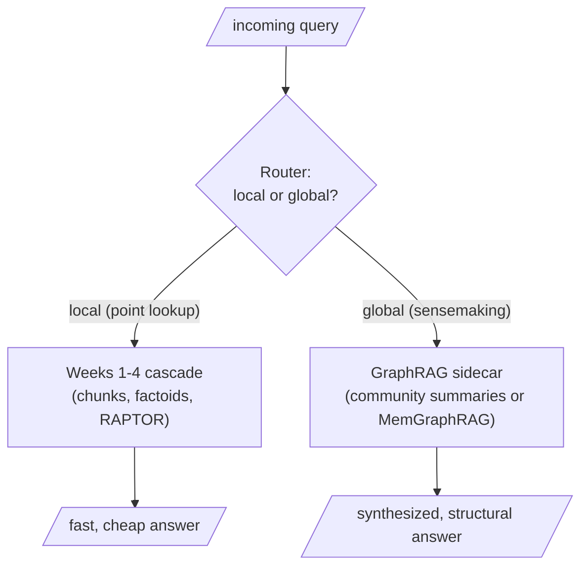

Papers from academia are great; the enterprise reads them through different lenses — economics, feasibility, scalability. This is the day's engineering verdict.

## The pattern: global sensemaking

GraphRAG approaches earn their keep on exactly one class of query: the query whose answer is a property of the corpus's structure, not of any passage in it. "What are the underlying leitmotifs of this novel?" "What are the major regulatory concerns across five hundred earnings calls?" "What are the dominant themes across everything our customers wrote us this quarter?" The signature is always the same: a human answering it would need to have read everything and formed a mental model — and the mental model *is* the entity graph with its communities. The community summaries (Microsoft) or the energy-settled subgraph (MemGraphRAG) are the only artifacts in your entire architecture that even contain the answer. Concretely: strategic dashboards fed by sensemaking queries, periodic corpus briefings, investigation and root-cause work where contradictions and bridges are precisely the gems, and hybrid answers combining the graph with Text2SQL and plain retrieval.

## The anti-patterns

| Anti-pattern | Why it fails |
|---|---|
| **The point query** — "What did the flood do to Tom and Maggie?" | A single passage answers it; routing through community summaries or a three-layer cascade is a telescope reading a wristwatch — slower, costlier, and often worse |
| **The small corpus** | Emergence needs mass. Run Leiden on fifteen entities and you get tiny "communities" whose summaries paraphrase the essay, at LLM prices. You cannot detect ocean currents in a bathtub |
| **The real-time chat lane** | Map–reduce is seconds-per-query; graph freshness is a batch concern. MemGraphRAG's sixty milliseconds helps, but construction cost and freshness burden remain |
| **The everything-graph** | The gravest one: shunting the whole corpus through graph construction because the demo was impressive |

## The sidecar: high-value documents, high-value queries

GraphRAG, in any variant, is always a **sidecar** — it extends the motorcycle; it never replaces it. It is expensive to build (an LLM call per chunk, then in the Microsoft lineage the summary pyramid, then forever the freshness tax) and expensive to serve unless you are Lazy (pay at query time) or Mem (paid at construction). So you route on two axes:

**High-value documents into the graph.** Not petabytes — select the sub-corpus whose global structure the organization actually needs to understand: the contracts, the filings, the research collection, the customer-voice corpus. The rest stays in the plain index, perfectly retrievable, unmapped.

**High-value queries through the graph.** A router classifies each query as local (point lookup) versus global (sensemaking), using the flood-question-versus-leitmotif-question litmus pair as its creed. The local majority flows through the standard cascade; the global minority — perhaps five to fifteen percent — is escorted to the sidecar. Those few are disproportionately the queries executives ask.



```python
# a toy router: classify by whether the query names a specific fact or asks for synthesis
GLOBAL_SIGNS = ["overall", "themes", "leitmotifs", "dominant", "across", "compare"]

def route(query: str) -> str:
    q = query.lower()
    if any(sign in q for sign in GLOBAL_SIGNS):
        return "sidecar (graph)"
    return "standard cascade"

print(route("What did Tom and Maggie's flood do?"))               # standard cascade
print(route("What are the dominant themes across the corpus?"))    # sidecar (graph)
```

Keep the ledger honest about quality, not just money. GraphRAG amplifies extraction quality: a noisy graph yields meaningless communities yields useless summaries. Entity resolution is load-bearing. And contradictions — if Critique B was taken seriously — are worth preserving in your graph as annotated, first-class edges, because in an enterprise the contradiction is often the single most valuable thing the graph will ever surface.

> **The one thing to remember.** The structure is real, the harvest is expensive, and the engineering art is knowing which queries deserve it. GraphRAG is a sidecar for high-value documents and high-value queries — never the whole motorcycle.
