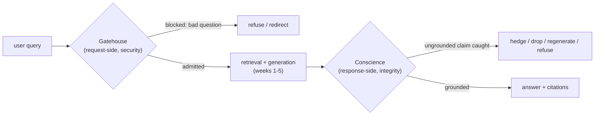

Picture a castle with two very different jobs at two very different doors. At the front gate stands a guard whose whole task is to keep out people who mean harm. At the back door, there's no guard at all — just a fact-checker, making sure the scholar walking out the door didn't misremember something from the books he read inside. Both jobs matter. They are nothing alike. And the single most common mistake in building a "safe" RAG system is doing only one of them and calling it done.

## The request-side gate: security against an adversary

For five weeks of this course, we built the interior of a retrieval-augmented generation system — chunking, embedding, retrieval cascades, derivative artifacts, graphs — and every one of those weeks quietly assumed two things: that a well-formed, good-faith question arrives at the front door, and that the answer handed back is trustworthy. This week, both assumptions come due.

The **request-side gate** is the gatehouse proper. Its virtue is **security** — defense. Here we face a real adversary: a human or automated actor who wants the system to misbehave and is actively probing for a way in. The posture here is deliberately suspicious, and rightly so: a false positive costs a user one rejected question; a false negative can cost an enterprise a screenshot on social media or a data-exfiltration incident.

## The response-side gate: integrity against ourselves

The **response-side gate** is something else entirely. Its virtue is not security but **integrity** — honesty. Here there is usually no adversary at all. What we guard against is our own system's sincere confabulation: the language model doing exactly what it was trained to do, producing fluent, confident, plausible text that happens not to be true to its sources. The exit gate is not a guard tower. It is a **conscience**.

Watch the medieval-castle picture do something instructive: it works perfectly at the entry and misleads at the exit. A gatehouse in the twelfth century was never one door — it was a portcullis, a drawbridge, murder holes, sometimes a barbican thrust out in front, each layer answering a different threat. That shape transfers exactly to request-side defense. But at the exit, if you keep picturing a castle, you'll imagine you're stopping a thief escaping with the silver. There is no thief. The person walking out is the castle's own scholar, and the only question is whether his report is faithful to the books he read inside. Guarding the exit isn't interdiction — it's fact-checking a friend who is prone to embellishment.

> Two gates, two virtues, two moral registers — and the deepest error in this whole subject is to build one gate, call it "guardrails," and ship a system that is unsafe in exactly the half its marketing promised to be safe.

## Why RAG is more exposed than a bare chatbot

A closed chatbot has one untrusted input: the user's message. A RAG system is exposed on three separate axes at once.

1. **It ingests an untrusted corpus.** A RAG pipeline reaches out and pulls documents into its own reasoning at query time — and a document is a place an adversary can hide an instruction long before any query ever arrives.
2. **It serves users with real permissions.** The same knowledge base holds the routine SOP and the sealed personnel file, and the gate must know *who* is asking before it decides *what* may be retrieved.
3. **Its central promise is a truth claim.** "Grounded in your documents" is a claim the system's own fluency is uniquely able to break, silently. A bare chatbot that invents a fact is merely wrong; a RAG system that invents a fact while wearing the costume of citation is wrong *and trusted*.

That is why guardrails cannot be bolted on at the end. They are two first-class gates, architected from the start.

## The gate's posture: Swiss cheese and the latency budget

The cheapest token is the one you never generate. A garbage query — a keyboard smash, a toxic provocation, an encoded jailbreak — consumes exactly the same embedding, search, rerank, and generation budget as a real one, and returns something at best useless and at worst a liability. The gatehouse is the sieve before the sieve: its whole question is "should we even try to answer this?" — and the answer is not always yes.

The governing picture for how to stack detectors is James Reason's **Swiss-cheese model** from safety engineering: every check is a slice of cheese with holes — its own failure modes. No slice is solid. But stack enough imperfect slices and the holes rarely line up: a threat that slips the first is very likely to strike solid cheese on the second or third. Safety is not one perfect gate; it is enough honest, imperfect gates that their holes stop aligning.

And you order the slices by cost — regex first, small classifier next, guard model, then a full LLM judge — so the cheap layers reject the easy cases before the expensive ones spend their latency budget. This is the retrieval funnel from earlier weeks, pointed the other way: there, we spent cheap compute to admit the many and expensive compute to rank the few; here, we spend cheap compute to reject the many and expensive compute to judge the few.

A workable budget table, front to back — the whole pipeline lives inside a fixed latency budget, typically well under a couple hundred milliseconds:

| Check | Approx. cost | What it needs |
|---|---|---|
| Rate limit | ~5 µs | a counter |
| Length / complexity bound | ~10 µs | a comparison |
| Deobfuscation + entropy | ~50 µs | regex and a log |
| Gibberish ladder | µs to low ms | hash set, regex, small stats |
| Language ID | low ms | fastText |
| Domain / intent classifier | ~10 ms | ModernBERT |
| Toxicity | ~10 ms | Detoxify-style model |
| Injection classifier | ~20 ms | pattern + small classifier |
| Loaded-question / escalated LLM check | 100 ms+ | reserved for ambiguous residue |

A well-built gatehouse adds under 100 ms to the request; a badly-built one, running sixteen independent model calls in series, adds seconds and makes the system feel broken. You spend the budget in inverse proportion to how often each check fires — the front of the funnel is where the fat head of bad traffic must die.

The threats sort naturally into four families, running roughly from the surface of the query to its intent: **(A)** malformed and evasive, **(B)** adversarial, **(C)** access and identity, and **(D)** abuse and economics. The next several pages walk each in turn.

## What both gates must accomplish

Read this once now, and once at the end of the week, as a checklist. A system that has both gates built well should be able to: name the two-gates frame and why the two thresholds differ (the entry gate errs toward suspicion, the exit gate errs toward disclosure); name the four request-side threat families; distinguish direct from indirect prompt injection; enforce RBAC as a pre-retrieval filter; quantify the false-positive tax of a deep gate stack; define groundedness and compute the faithfulness triad; build the assertion-evidence graph; lay out the response-side escalation ladder; distinguish refusal (binary, values-based) from humility (graded, epistemic); and turn an uncertainty signal into a conformal abstention rule with a provable guarantee. Everything that follows this week is an unfolding of these two gates, one family and one formula at a time.
