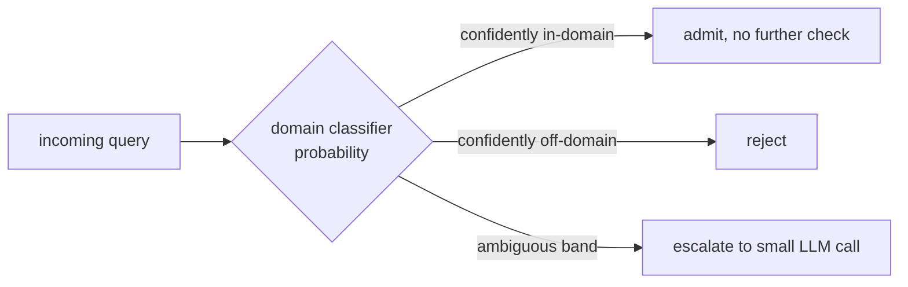

Sixteen-odd detectors deployed as sixteen independent calls would blow the latency budget and build sixteen things nobody owns. They need one cheap gate at the front that earns its keep on the widest slice of traffic.

## The cheap first gate: intent and domain classification

A RAG system exists for a purpose — a pharmaceutical company's system answers questions about drug interactions and clinical trials, not stock tips or celebrity gossip. A fast fine-tuned encoder can decide, in under 10 ms, whether an arriving query is even about that purpose. **ModernBERT** is ideal for the job: an encoder-only transformer with rotary positional embeddings, Flash Attention, and an 8K context window, fine-tuned on a few thousand labeled in-domain and out-of-domain examples to production accuracy within hours.

It does double duty. As a **gate**, it rejects the off-scope query before any expensive detector runs. As a **router**, it tags the survivor's intent — factual lookup, comparison, summarization, synthesis, procedural — so downstream components pick the right retrieval strategy: a factoid goes to the dense+sparse cascade, a synthesis question routes to the GraphRAG sidecar, chitchat gets a canned response. The classifier is only as good as its negative class, so curate out-of-domain examples with the same care you brought to the retrieval corpus — not just "random questions" but the off-domain queries your users actually ask.

Read the classifier's probability, not just its label, as three bands:



Let the cheap model's own uncertainty route the escalation: cost then scales with the width of the confusion band, not with total traffic. A system confident 95% of the time spends the expensive model on only 5% of queries — the Swiss-cheese doctrine turned into a routing rule, and it reappears almost unchanged as Act II's verification ladder.

> **From the field.** One client's app answered questions about one narrow domain — logistics — but forwarded every query to a premium answer-engine API, and users had discovered the portal would answer anything: homework, recipes, travel itineraries, essays. A single in-domain ModernBERT gate — "is this about logistics?" — stopped the bleeding overnight.

That same gate paid an unbudgeted **safety dividend**: because it admits only what is in domain, it silently rejects everything that is not, and the logs were full of "who is Hitler?", politics, and religion, all falling away as a byproduct of one narrow question. The domain gate had become a toxicity filter it was never designed to be — but a dedicated toxicity layer is still run behind it, and rightly so, because the domain gate catches most off-topic toxicity for free while the toxicity filter catches the *in-domain* malice the domain gate waves through (a slur inside a genuinely on-topic logistics question). Their holes do not align — Swiss cheese observed in a production log, not drawn on a slide.

## Content safety: the dedicated toxicity layer

Some questions are not questions at all but traps wearing a question mark — *"why are most criminals from group X?"* — and there is no good answer. Engage the premise and you've legitimized a bigoted framing; correct it and the enterprise system is arguing about a topic it should never have touched; answer at all and the screenshot is on social media within the hour. Toxicity detection is not about politeness — it is about enterprise survival.

| Model | What it is |
|---|---|
| **Detoxify** | open-source workhorse; fine-tuned transformer on Jigsaw corpora; scores toxicity, severe toxicity, obscenity, threat, insult, identity attack in single-digit ms on GPU |
| **Perspective API** (Google/Jigsaw) | hosted, multilingual, character-level; useful as a second opinion or when you'd rather not host a model |
| **Llama Guard** (Meta) | heavier, more nuanced; scores both prompts and responses against a configurable taxonomy; can tell a user *discussing* violence from a user *requesting* it |

The engineering choice is a latency-versus-nuance trade: Detoxify at the front for the fat head of obvious toxicity, Llama Guard held back for the ambiguous residue — the cheapest-first funnel again.

Every one of these models returns a **score**, not a verdict — turning it into an action means choosing operating points. The standard three-band policy:

```python
# toy three-band toxicity policy
def toxicity_action(score: float) -> str:
    if score > 0.9:
        return "hard_reject"
    if score > 0.5:
        return "flag_for_review"       # e.g., route to the domain classifier as a second opinion
    return "pass"

for s in [0.95, 0.6, 0.1]:
    print(f"score={s} -> {toxicity_action(s)}")
```

The middle band is where judgment must live. The canonical trap: a finance analyst asks, in perfect good faith, *"what is the company's policy on hate speech?"* — a legitimate, on-domain question whose own words spike a naive classifier. A hard-reject threshold set too low blocks her and teaches her the system is broken; the flag-for-review path routes the query instead to a second opinion — often the domain classifier from above, which confirms the question is on-topic and benign.

> **Why this matters legally.** In 2023 an airline was held bound by a bereavement-fare policy its customer-service chatbot hallucinated — the tribunal made it honor the invented terms. If a fabricated refund policy creates binding liability, imagine the exposure from a toxic or discriminatory answer generated in the enterprise's own voice. This is why content safety is a first-class gate and not a courtesy.
