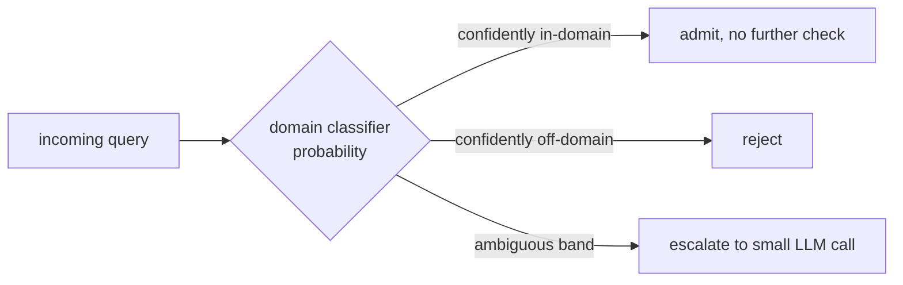

Sixteen-odd detectors deployed as sixteen independent calls would blow the latency budget and build sixteen things nobody owns. They need one cheap gate at the front that earns its keep on the widest slice of traffic.

## Core intuition

The fastest, best-performing guardrail is often the simplest classifier that screens the vast majority of traffic before the expensive layer is reached. This turns the gatehouse into a funnel instead of a flat wall.

## Why it matters

A costly detector should not run on every request. A cheap gate that filters most irrelevant or toxic inputs makes the entire stack economically and operationally viable.

## Instructor framing

The logistics-company anecdote and the "safety dividend" observation together make a subtle point worth drawing out explicitly: a domain gate was never designed as a safety mechanism, yet it silently absorbed most off-topic toxicity as a side effect of its actual job. This is a good moment to generalize — a well-scoped system often gets significant, unplanned safety benefit purely from having a narrow purpose, which is an argument for narrow-scope product design quite apart from any explicit safety engineering.

## Worked example


Suppose a pharmaceutical company deploys a RAG assistant meant to answer questions about drug interactions and trial data. Before the domain gate existed, the system dutifully answered "write me a cover letter," "what's a good pasta recipe," and — troublingly — a handful of queries testing whether it would discuss illegal drug synthesis, because "drug" is a domain-relevant word and the query passed every other check. After deploying a ModernBERT classifier fine-tuned on a few thousand labeled examples of genuine in-domain questions versus everything else, over 90% of traffic never reaches any other gate: the cover-letter and recipe requests are rejected in under 10ms with no embedding, no retrieval, no generation call spent. The illegal-synthesis probes, which happen to use domain-adjacent vocabulary, still get through the domain gate — and that's exactly why a dedicated toxicity layer runs behind it: the two gates are checking genuinely different things; being on-topic and being safe are independent properties, and a system needs both checks precisely because passing one says nothing about the other.

This is the engineering simplification that protects the product: route traffic through the cheapest gates first, and only escalate when ambiguity remains.

## The cheap first gate: intent and domain classification

A RAG system exists for a purpose — a pharmaceutical company's system answers questions about drug interactions and clinical trials, not stock tips or celebrity gossip. A fast fine-tuned encoder can decide, in under 10 ms, whether an arriving query is even about that purpose. **ModernBERT** is ideal for the job: an encoder-only transformer with rotary positional embeddings, Flash Attention, and an 8K context window, fine-tuned on a few thousand labeled in-domain and out-of-domain examples to production accuracy within hours.

It does double duty. As a **gate**, it rejects the off-scope query before any expensive detector runs. As a **router**, it tags the survivor's intent — factual lookup, comparison, summarization, synthesis, procedural — so downstream components pick the right retrieval strategy: a factoid goes to the dense+sparse cascade, a synthesis question routes to the GraphRAG sidecar, chitchat gets a canned response. The classifier is only as good as its negative class, so curate out-of-domain examples with the same care you brought to the retrieval corpus — not just "random questions" but the off-domain queries your users actually ask.

Read the classifier's probability, not just its label, as three bands:



Let the cheap model's own uncertainty route the escalation: cost then scales with the width of the confusion band, not with total traffic. A system confident 95% of the time spends the expensive model on only 5% of queries — the Swiss-cheese doctrine turned into a routing rule, and it reappears almost unchanged as Act II's verification ladder.

> **From the field.** One client's app answered questions about one narrow domain — logistics — but forwarded every query to a premium answer-engine API, and users had discovered the portal would answer anything: homework, recipes, travel itineraries, essays. A single in-domain ModernBERT gate — "is this about logistics?" — stopped the bleeding overnight.

That same gate paid an unbudgeted **safety dividend**: because it admits only what is in domain, it silently rejects everything that is not, and the logs were full of "who is Hitler?", politics, and religion, all falling away as a byproduct of one narrow question. The domain gate had become a toxicity filter it was never designed to be — but a dedicated toxicity layer is still run behind it, and rightly so, because the domain gate catches most off-topic toxicity for free while the toxicity filter catches the *in-domain* malice the domain gate waves through (a slur inside a genuinely on-topic logistics question). Their holes do not align — Swiss cheese observed in a production log, not drawn on a slide.

## Content safety: the dedicated toxicity layer

Some questions are not questions at all but traps wearing a question mark — *"why are most criminals from group X?"* — and there is no good answer. Engage the premise and you've legitimized a bigoted framing; correct it and the enterprise system is arguing about a topic it should never have touched; answer at all and the screenshot is on social media within the hour. Toxicity detection is not about politeness — it is about enterprise survival.

| Model | What it is |
|---|---|
| **Detoxify** | open-source workhorse; fine-tuned transformer on Jigsaw corpora; scores toxicity, severe toxicity, obscenity, threat, insult, identity attack in single-digit ms on GPU |
| **Perspective API** (Google/Jigsaw) | hosted, multilingual, character-level; useful as a second opinion or when you'd rather not host a model |
| **Llama Guard** (Meta) | heavier, more nuanced; scores both prompts and responses against a configurable taxonomy; can tell a user *discussing* violence from a user *requesting* it |

The engineering choice is a latency-versus-nuance trade: Detoxify at the front for the fat head of obvious toxicity, Llama Guard held back for the ambiguous residue — the cheapest-first funnel again.

Every one of these models returns a **score**, not a verdict — turning it into an action means choosing operating points. The standard three-band policy:

```python
# toy three-band toxicity policy
def toxicity_action(score: float) -> str:
    if score > 0.9:
        return "hard_reject"
    if score > 0.5:
        return "flag_for_review"       # e.g., route to the domain classifier as a second opinion
    return "pass"

for s in [0.95, 0.6, 0.1]:
    print(f"score={s} -> {toxicity_action(s)}")
```

The middle band is where judgment must live. The canonical trap: a finance analyst asks, in perfect good faith, *"what is the company's policy on hate speech?"* — a legitimate, on-domain question whose own words spike a naive classifier. A hard-reject threshold set too low blocks her and teaches her the system is broken; the flag-for-review path routes the query instead to a second opinion — often the domain classifier from above, which confirms the question is on-topic and benign.

> **Why this matters legally.** In 2023 an airline was held bound by a bereavement-fare policy its customer-service chatbot hallucinated — the tribunal made it honor the invented terms. If a fabricated refund policy creates binding liability, imagine the exposure from a toxic or discriminatory answer generated in the enterprise's own voice. This is why content safety is a first-class gate and not a courtesy.


## Math explained step by step

Explain why routing on classifier *confidence* (three bands), rather than a single threshold, minimizes total cost, using the same logic as the length-gate's tiers two pages ago.

**Step 1 — recognize the classifier outputs a probability, not a certainty.** A domain classifier's output $P(\text{in-domain} \mid q)$ near 0.99 or near 0.01 reflects genuine confidence; an output near 0.5 reflects genuine ambiguity — treating all three cases identically (a single hard threshold) throws away information the classifier is already giving you for free.

**Step 2 — see why the confident bands can skip expensive verification entirely.** If $P(\text{in-domain}) > 0.95$ or $< 0.05$, the classifier's own calibration says it is very unlikely to be wrong — spending an expensive LLM call to double-check a decision the cheap classifier is already 95%+ confident about buys almost no additional accuracy for real cost, which is exactly why these bands route to immediate admit/reject.

**Step 3 — see why the escalation cost scales with the width of the ambiguous band, not with total traffic.** If a well-calibrated classifier places 90% of real traffic in the confident bands and only 10% in the ambiguous middle, then a costly small-LLM verification step runs on 10% of queries, not 100% — total expected cost is $0.9 \times c_{\text{cheap}} + 0.1 \times (c_{\text{cheap}} + c_{\text{LLM}})$, dominated by the cheap classifier's cost for the vast majority of traffic.

**Step 4 — see why a *narrower* confusion band (better classifier calibration) directly reduces cost.** As the classifier improves (via more or better-curated training data — remember, "curate out-of-domain examples with the same care as the retrieval corpus"), the ambiguous band shrinks, sending less traffic to the expensive escalation path. This gives a direct, measurable incentive to invest in classifier training data quality: every percentage point the confusion band shrinks by is real, quantifiable savings on downstream LLM calls, not just an abstract accuracy improvement.

## Practical pattern

Standing up the cheap-first funnel for a real deployment:

1. build the domain/intent classifier before any other content-safety layer, and budget real effort into curating its negative (out-of-domain) class from your own actual off-topic traffic logs, not generic "random text" — the classifier's usefulness is capped by how representative its negative examples are;
2. use the classifier's raw probability, not just its thresholded label, to drive a three-band routing decision (confident-admit, confident-reject, escalate) rather than a single cutoff — this is the mechanism that keeps the expensive layers cheap in aggregate;
3. deploy toxicity detection as a genuinely separate layer from the domain gate, tuned with its own three-band policy (hard-reject, flag-for-review, pass) — do not assume the domain gate's incidental toxicity filtering is sufficient, since it only catches off-topic toxicity, not in-domain toxicity wearing the costume of a legitimate question;
4. route the toxicity layer's ambiguous middle band back through the domain classifier as a second opinion where applicable — the finance-analyst hate-speech-policy example shows this composition catching exactly the case a toxicity classifier alone would misfire on.

## Common traps

- deploying one classifier to do both jobs (domain relevance and toxicity) and assuming a single score can capture two genuinely independent properties — a query can be on-topic and toxic, or off-topic and harmless, and conflating the two checks misses both failure modes;
- using only the classifier's thresholded label rather than its raw probability, discarding the calibration information that makes confidence-based routing possible and forcing every query through the same fixed cost path;
- under-investing in negative-class curation for the domain classifier, then discovering in production that its "out-of-domain" examples never resembled the actual off-topic queries real users send;
- treating a toxicity classifier's score as a verdict rather than a signal requiring a graded policy — a naive single hard-reject threshold either blocks legitimate on-topic questions that happen to use sensitive vocabulary, or lets genuinely toxic content through at the same cutoff.

## Takeaways

- A cheap domain/intent classifier at the front of the gate stack absorbs the majority of both off-topic traffic and, as an unplanned side effect, a large share of off-topic toxicity — but it cannot substitute for a dedicated toxicity layer, because on-topic and toxic are independent properties.
- Routing on classifier confidence (three bands: confident-admit, confident-reject, escalate) rather than a single threshold keeps expensive verification calls proportional to genuine ambiguity, not total traffic volume.
- Concretely: invest disproportionately in curating your domain classifier's negative (out-of-domain) examples from real off-topic traffic — every improvement in classifier calibration directly and measurably shrinks the expensive escalation path's cost.
