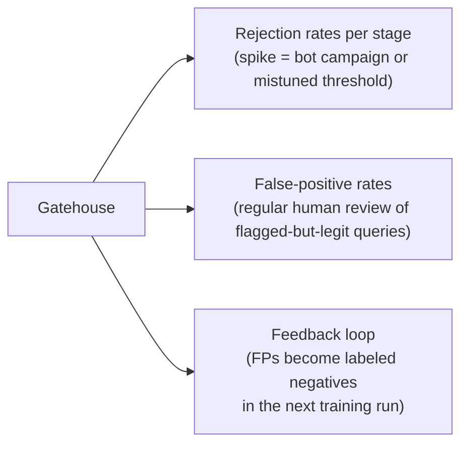

A gate that blocks legitimate enterprise queries is worse than useless — and the arithmetic of *why* is the hardest, most underrated truth in this whole Act.

## Core intuition

False positives compound across a layered system. One gate may seem harmless, but a stack of harmless gates can quietly block a large fraction of legitimate traffic.

## Why it matters

The real challenge is not only stopping bad inputs; it is preserving usability while under attack. The best guardrail is one whose rejection rates are measured and tuned, not merely feared.

## Instructor framing

This page is the necessary corrective after eight pages of "add another gate" — make sure students leave with the arithmetic itself (compounding false-positive rates), not just the moral ("don't over-gate"). The finance-analyst example recurring from the previous page is deliberate: the same scenario now demonstrates a *systemic* cost (the 15% figure) rather than a single anecdote, and that shift from anecdote to arithmetic is the whole point of this page.

## Worked example


Suppose a company proudly reports that each of its sixteen gates has a 99% precision rate on its own held-out test set — an impressive number in isolation, and the kind of statistic that goes into a security review deck without raising alarm. But run 10,000 real legitimate employee queries through the full stack, and roughly 1,500 of them get rejected by at least one of the sixteen gates along the way — not because the queries were bad, but because sixteen independent 1%-error dice were rolled for every single query, and the odds of all sixteen coming up clean are worse than they look. Each individual gate's owner can point to their own dashboard and see "haven't touched my 99% precision," while the product team watches usage quietly erode, because no one dashboard shows the compounded number — only the full-stack simulation does.

This page is the reminder that guardrails must be engineered for the full system, not for a single model output in isolation.

## The false-positive tax

A suspicious posture is right at any single gate — one rejected question is a cheap error. But false-positive rates **compound** across a deep stack. If sixteen gates each wrongly block just 1% of good queries, the probability a legitimate query survives all sixteen is

$$0.99^{16} \approx 0.85$$

**Work it by hand.** $\ln(0.99) \approx -0.01005$; multiply by 16 to get $-0.1608$; exponentiate: $e^{-0.1608} \approx 0.851$. So the stack turns away roughly $1 - 0.851 = 14.9\% \approx 15\%$ — about **one legitimate query in six** — through no fault of the user.

```python
# the compounding false-positive tax across a deep gate stack
n_gates = 16
fp_rate_per_gate = 0.01

survival = (1 - fp_rate_per_gate) ** n_gates
turned_away = 1 - survival
print(f"probability a legit query survives all {n_gates} gates: {survival:.3f}")
print(f"fraction of legit queries wrongly turned away: {turned_away:.1%}")
```

Picture who that is: the finance analyst whose real question about the firm's hate-speech policy trips the toxicity gate on the word "hate," concludes — correctly — that the system does not work, and goes back to the search bar for good.

**The fix is to tune the stack, not the gate.** Reserve hard rejects for high-confidence detections; route the ambiguous middle to a cheap second opinion or a graceful clarify-and-retry rather than a flat block; and measure the gatehouse the way you measure a retriever — by precision and recall on a curated set of adversarial and benign queries, tracked *per stage* so you can see which gate is over-firing. A sudden spike in one stage's rejections is a signal (a bot campaign, a mis-tuned threshold, a legitimate new use case the domain gate hasn't learned yet), and false positives should feed back into the classifiers' training data — the gatehouse is a living system, not a static configuration.

> A gate you cannot measure is a gate you cannot trust — and a stack you tune only for safety, never for the legitimate query it turns away, is a stack that will be quietly abandoned by exactly the users it was built for.

## Orchestrating the gatehouse: defense in depth in production

Stand back and watch the gates work as one system — the architecture's strength was never in any single slice but in how the slices overlap:

- A toxic query encoded in base64 is decoded by the obfuscation layer and then scored by the toxicity layer.
- A loaded question about an off-domain topic is caught by the domain gate *and* the false-premise check.
- A jailbreak in Zulu is caught by the language gate and then, post-translation, by the injection detector.
- A user above their clearance is stopped by RBAC even if every content gate waved the query through.
- A two-thousand-token prompt with an injection buried mid-stream dies at the length gate before the injection detector ever spins up.
- A bot firing fifty paraphrased jailbreaks trips the rate limiter (volume), the near-duplicate detector (pattern), and the multi-turn monitor (trajectory) — three uncorrelated signals, each alone sufficient.

The redundancy is deliberate: correlated failure is how defenses die. Two gates whose errors line up are, together, no stronger than one.

## Graceful degradation: refusing well

How a gate says "no" matters almost as much as that it said it. A bare `"Error: request blocked"` converts a safety success into a usability failure, and teaches the legitimate user the system is capricious. Graceful degradation owes the user four things:

1. a clear, non-technical explanation of why the query wasn't processed;
2. a concrete suggestion for how to rephrase, where one applies;
3. an escalation path (contact support, file a ticket, request a review);
4. enough logging behind the scenes to make the event auditable and debuggable.

This is the same craft Act III raises to a principle under the name *refusal* — and notice the one rule that already governs it here: **how much a block may explain itself depends on which gate fired.** A security block must give the adversary nothing; a domain block can say freely, "this system only answers questions about logistics." The gatehouse's refusals are the first draft of the three doors.

## Telemetry along three axes

None of this is a static configuration — it is a living system that must be instrumented or it will silently rot.



> The gatehouse is not a wall you build once. It is a garden you tend.


## Math explained step by step

Derive the compounding false-positive tax precisely, then show why it is worse — not better — than intuition suggests.

**Step 1 — model surviving one gate as an independent Bernoulli event.** If a gate wrongly rejects a legitimate query with probability $q=0.01$, it lets it through with probability $1-q=0.99$. Treating each gate's error as independent of the others (a reasonable first approximation if the gates check unrelated properties, as most of the sixteen do), the probability of surviving *all* $n$ gates is the product $(1-q)^n$.

**Step 2 — compute this for $n=16$ using logarithms, exactly as the page does.** $\ln(0.99) \approx -0.01005$ (using the approximation $\ln(1-x) \approx -x$ for small $x$). Multiplying by 16 gives $-0.1608$. Exponentiating, $e^{-0.1608} \approx 0.851$ — so about 85.1% of legitimate queries survive the full stack, meaning roughly 14.9% do not.

**Step 3 — see why intuition typically underestimates this.** A gate owner looking only at their own 1% error rate intuits "1% of queries affected" and stops there — the mistake is treating the 1% as the total system impact rather than one term in a product. The correct mental model is not "1% plus 1% plus... = 16%" (which happens to be numerically close here, coincidentally) but genuinely multiplicative: $(1-q)^n$, which for larger $q$ or $n$ diverges further from the naive additive estimate. At $q=0.02$, sixteen gates would survive at $(0.98)^{16}\approx 0.724$ — a 27.6% rejection rate, noticeably worse than doubling the 14.9% figure would suggest.

**Step 4 — see the two levers this formula makes explicit for reducing the tax.** Since the survival probability is $(1-q)^n$, you can improve it by shrinking $q$ (making each gate more precise — the harder, more expensive lever) or shrinking $n$ (running fewer independent hard-reject gates, routing more decisions through shared, correlated signals or a single well-tuned escalation path — the architectural lever this page's "tune the stack, not the gate" advice actually points to). A stack of five well-tuned gates at $q=0.005$ each survives at $(0.995)^5 \approx 97.5\%$ — a smaller, more carefully-tuned stack can beat a larger, sloppier one on this metric even though it has "fewer layers of protection" on paper.

## Practical pattern

Managing the false-positive tax in a real gate stack:

1. measure end-to-end legitimate-query survival rate across the *full* stack on a real or representative traffic sample — never trust the product of individually-reported per-gate precision numbers as a proxy, since correlated failures and measurement differences between teams can make the real number worse than the naive calculation;
2. track rejection rates per stage in production dashboards, not just an aggregate pass/fail count — a spike in one specific gate's rejection rate is diagnostic (a bot campaign, a mistuned threshold, model drift) in a way an aggregate number cannot be;
3. reserve hard rejection for high-confidence detections only, and route genuinely ambiguous cases to a second opinion or a graceful clarify-and-retry rather than adding another hard-reject gate to the stack — this directly reduces the effective $n$ of independent all-or-nothing checks a legitimate query must clear;
4. feed confirmed false positives back into training data for the classifiers that produced them — the gate stack's precision should measurably improve over time as a living system, not stay fixed at its launch-day calibration.

## Common traps

- reporting and reviewing each gate's precision in isolation without ever computing or monitoring the compounded, end-to-end legitimate-query survival rate across the full stack;
- adding gates indiscriminately in response to each newly-discovered threat without weighing the cumulative false-positive cost each addition contributes multiplicatively to the whole stack;
- assuming per-gate error rates are independent when they may be correlated (several gates trained on overlapping data, or several triggered by the same surface feature), which can make the real compounded error rate different from the naive independent-events formula in either direction;
- treating a hard reject as the default response for every gate, rather than reserving hard rejects for high-confidence detections and routing ambiguous cases through a cheaper, less costly-to-legitimate-users escalation path.

## Takeaways

- False-positive rates compound multiplicatively across a layered gate stack, not additively — sixteen gates each wrongly rejecting just 1% of legitimate traffic combine to reject roughly 15%, a number that surprises almost everyone who only looked at each gate's own dashboard.
- The fix operates on two levers: making each gate more precise (expensive, slow) or reducing how many independent hard-reject checks a query must clear (architectural, often cheaper) — a smaller, well-tuned stack can outperform a larger, sloppier one on end-to-end legitimate-query survival.
- Concretely: before adding a new hard-reject gate to a production stack, compute its effect on the full-stack survival probability using $(1-q)^n$, not its standalone precision number — the number that matters is the one no single gate's dashboard shows.
