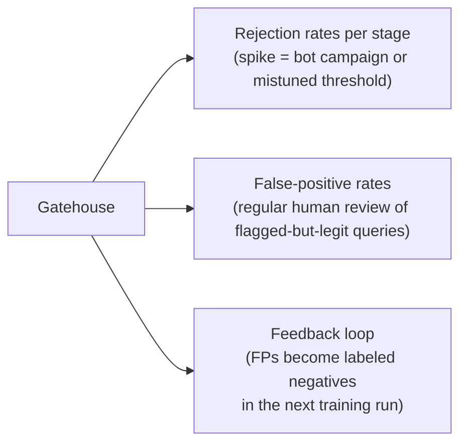

A gate that blocks legitimate enterprise queries is worse than useless — and the arithmetic of *why* is the hardest, most underrated truth in this whole Act.

## The false-positive tax

A suspicious posture is right at any single gate — one rejected question is a cheap error. But false-positive rates **compound** across a deep stack. If sixteen gates each wrongly block just 1% of good queries, the probability a legitimate query survives all sixteen is

$$0.99^{16} \approx 0.85$$

**Work it by hand.** $\ln(0.99) \approx -0.01005$; multiply by 16 to get $-0.1608$; exponentiate: $e^{-0.1608} \approx 0.851$. So the stack turns away roughly $1 - 0.851 = 14.9\% \approx 15\%$ — about **one legitimate query in six** — through no fault of the user.

```python
# the compounding false-positive tax across a deep gate stack
n_gates = 16
fp_rate_per_gate = 0.01

survival = (1 - fp_rate_per_gate) ** n_gates
turned_away = 1 - survival
print(f"probability a legit query survives all {n_gates} gates: {survival:.3f}")
print(f"fraction of legit queries wrongly turned away: {turned_away:.1%}")
```

Picture who that is: the finance analyst whose real question about the firm's hate-speech policy trips the toxicity gate on the word "hate," concludes — correctly — that the system does not work, and goes back to the search bar for good.

**The fix is to tune the stack, not the gate.** Reserve hard rejects for high-confidence detections; route the ambiguous middle to a cheap second opinion or a graceful clarify-and-retry rather than a flat block; and measure the gatehouse the way you measure a retriever — by precision and recall on a curated set of adversarial and benign queries, tracked *per stage* so you can see which gate is over-firing. A sudden spike in one stage's rejections is a signal (a bot campaign, a mis-tuned threshold, a legitimate new use case the domain gate hasn't learned yet), and false positives should feed back into the classifiers' training data — the gatehouse is a living system, not a static configuration.

> A gate you cannot measure is a gate you cannot trust — and a stack you tune only for safety, never for the legitimate query it turns away, is a stack that will be quietly abandoned by exactly the users it was built for.

## Orchestrating the gatehouse: defense in depth in production

Stand back and watch the gates work as one system — the architecture's strength was never in any single slice but in how the slices overlap:

- A toxic query encoded in base64 is decoded by the obfuscation layer and then scored by the toxicity layer.
- A loaded question about an off-domain topic is caught by the domain gate *and* the false-premise check.
- A jailbreak in Zulu is caught by the language gate and then, post-translation, by the injection detector.
- A user above their clearance is stopped by RBAC even if every content gate waved the query through.
- A two-thousand-token prompt with an injection buried mid-stream dies at the length gate before the injection detector ever spins up.
- A bot firing fifty paraphrased jailbreaks trips the rate limiter (volume), the near-duplicate detector (pattern), and the multi-turn monitor (trajectory) — three uncorrelated signals, each alone sufficient.

The redundancy is deliberate: correlated failure is how defenses die. Two gates whose errors line up are, together, no stronger than one.

## Graceful degradation: refusing well

How a gate says "no" matters almost as much as that it said it. A bare `"Error: request blocked"` converts a safety success into a usability failure, and teaches the legitimate user the system is capricious. Graceful degradation owes the user four things:

1. a clear, non-technical explanation of why the query wasn't processed;
2. a concrete suggestion for how to rephrase, where one applies;
3. an escalation path (contact support, file a ticket, request a review);
4. enough logging behind the scenes to make the event auditable and debuggable.

This is the same craft Act III raises to a principle under the name *refusal* — and notice the one rule that already governs it here: **how much a block may explain itself depends on which gate fired.** A security block must give the adversary nothing; a domain block can say freely, "this system only answers questions about logistics." The gatehouse's refusals are the first draft of the three doors.

## Telemetry along three axes

None of this is a static configuration — it is a living system that must be instrumented or it will silently rot.



> The gatehouse is not a wall you build once. It is a garden you tend.
