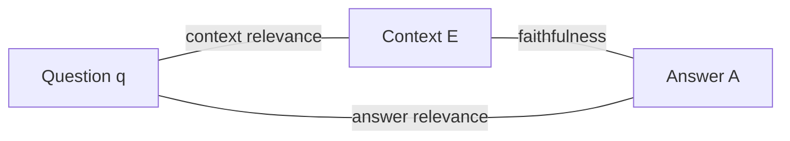

Dorothy walks the length of the throne room toward a voice that booms like weather. Then Toto, who cares nothing for reputations, trots over and tugs a curtain aside to reveal a small man from Omaha working levers and a microphone. The Great and Powerful Oz is a projection — the machinery is real, but the authority was staged.

A retrieval-augmented system in production is forever one tug of a curtain away from being Oz. It speaks fluently, formatted, footnoted, without a tremor of doubt — and the user, like Dorothy, has no way to see behind the curtain to the evidence that was, or was not, actually retrieved. When the answer is grounded, the confidence is earned. When it isn't, we've built Oz: a hollow performance of knowing.

On the way in (Act I) we guarded against malice. On the way out, we guard against **sincerity** — the generator is not lying; it genuinely does not distinguish, at generation time, between a sentence it read in the evidence and a sentence it merely finds plausible. Both feel the same from inside next-token prediction. Our job is not to punish the generator but to give it a conscience it doesn't natively possess: a habit, enforced from outside, of checking each claim against the evidence before it speaks. The system we build does the inverse of Oz — it pulls back its own curtain before the user ever sees the show.

## Making "grounded" precise

Let $A$ be a generated answer and $E = \{e_1, \ldots, e_k\}$ the retrieved evidence in the generator's context. Decompose $A$ into its atomic claims $C(A) = \{c_1, \ldots, c_m\}$ — each $c_i$ a single, independently checkable assertion. The answer is **grounded (faithful)** iff every atomic claim is entailed by the evidence:

$$\forall c_i \in C(A)\ \exists e_j \in E : e_j \models c_i$$

where $\models$ denotes textual entailment — a competent reader of $e_j$ alone would agree that $c_i$ follows. Three words carry the weight: **every** — one ungrounded sentence in ten sinks the whole paragraph, because the reader can't tell which sentence to distrust. **Atomic** — the unit of grounding is the smallest assertion, not the paragraph, since a sentence can be half-true. **Entailed by the evidence** — not "true," not "plausible," but supported by the specific passages actually retrieved.

That last phrase is deliberately blind to truth in the world: a grounded system can faithfully repeat a falsehood present in its corpus, and that is *correct* behavior — the falsehood is now the corpus's fault, auditably, rather than the model's confabulation. Groundedness buys accountability, not omniscience: it relocates every error to a place we can inspect.

From the definition falls a metric — a continuous faithfulness score instead of a brittle yes/no:

$$F(A, E) = \frac{|\{c_i \in C(A) : \exists e_j,\ e_j \models c_i\}|}{|C(A)|} \in [0, 1]$$

This is, up to implementation detail, exactly the **faithfulness** metric of the Ragas framework.

**Worked example.** Suppose an answer decomposes into 10 atomic claims, and an entailment check finds evidence supporting 6 of them. Then $F(A, E) = 6/10 = 0.6$ — four sentences in ten are Oz booming into a microphone.

```python
# a toy faithfulness scorer: crude keyword-overlap stand-in for a real NLI check
claims = [
    "the policy applies to full-time employees",
    "the policy applies to all employees",       # subtly wrong — evidence says "full-time"
    "leave accrues at two days per month",
]
evidence = ["Full-time employees accrue paid leave at two days per month."]

def naively_entailed(claim, evidence_list):
    claim_words = set(claim.lower().split())
    return any(len(claim_words & set(e.lower().split())) / len(claim_words) > 0.6 for e in evidence_list)

grounded = [naively_entailed(c, evidence) for c in claims]
F = sum(grounded) / len(claims)
print(list(zip(claims, grounded)))
print(f"faithfulness F(A, E) = {F:.2f}")
```

## Faithfulness alone is a trap — the triad

A system can be perfectly faithful and perfectly useless: ask it the capital of France, let it answer "the retrieved document discusses monetary policy," and every claim is grounded while the answer is worthless. Faithfulness measures one edge of a triangle — and a triangle has three vertices: the question $q$, the retrieved context $E$, and the generated answer $A$.



| Edge | Audits | Low score means |
|---|---|---|
| **Faithfulness** (context ↔ answer) | the generator | it's inventing claims not in the evidence |
| **Answer relevance** (question ↔ answer) | whether it answered the right question | a faithful but evasive answer — true, grounded, beside the point |
| **Context relevance** (question ↔ context) | the retriever | the generator was handed irrelevant context, tempted to fall back on parametric memory |

Ragas estimates answer relevance by having an LLM generate several questions $A$ would be a good answer to, embedding them, and measuring mean cosine similarity to the real $q$:

$$AR(A, q) = \frac{1}{n} \sum_{i=1}^{n} \cos\big(v(q), v(\tilde{q}_i)\big), \qquad \tilde{q}_i \sim \text{LLM}(A)$$

> A single faithfulness number tells you the answer is wrong; the triad tells you **who** was wrong. High context relevance with low faithfulness is a generator ignoring good evidence; high faithfulness with low context relevance is a generator being honest about garbage; high faithfulness and relevance with low answer relevance is a system solving a question no one asked. Conscience is not one measurement — it is a triangulation.

## A hallucination taxonomy to keep in your pocket

- **Intrinsic** — the answer contradicts the evidence ("all employees" where the source says "full-time employees").
- **Extrinsic** — the answer adds a claim the evidence is simply silent about, imported from parametric memory.
- **Fabrication** — the model invents an entity, a statute number, a citation that exists nowhere.

Faithfulness as defined catches all three, because each produces at least one atomic claim with no entailing passage — but they call for different remedies, which is where the assertion-evidence graph (next page) becomes indispensable.
