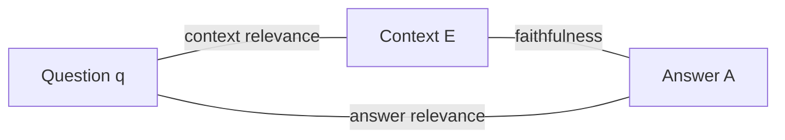

Dorothy walks the length of the throne room toward a voice that booms like weather. Then Toto, who cares nothing for reputations, trots over and tugs a curtain aside to reveal a small man from Omaha working levers and a microphone. The Great and Powerful Oz is a projection — the machinery is real, but the authority was staged.

A retrieval-augmented system in production is forever one tug of a curtain away from being Oz. It speaks fluently, formatted, footnoted, without a tremor of doubt — and the user, like Dorothy, has no way to see behind the curtain to the evidence that was, or was not, actually retrieved. When the answer is grounded, the confidence is earned. When it isn't, we've built Oz: a hollow performance of knowing.

## Core intuition

A model can be fluent without being grounded. The real architectural problem is not whether it sounds certain, but whether each claim in its answer is actually backed by the evidence it retrieved.

## Why it matters

This is the response-side guardrail: without it, the system can answer confidently while saying things the evidence never supported. Groundedness converts vague certainty into accountable evidence.

## Instructor framing

The Oz metaphor earns its keep specifically through the line "the machinery is real, but the authority was staged" — press students to see that fluency (the machinery) and groundedness (the authority) are independent properties, exactly the same independence lesson as Family C's authorization-versus-content distinction two pages ago. This is Act II's version of a pattern the course keeps returning to: two properties that look like one, and a system that only checks one of them.

## Worked example


Suppose a benefits question asks "does our health plan cover physical therapy?" and the retriever surfaces a passage stating "the plan covers physical therapy up to 20 visits per year with a physician referral." A faithful answer would repeat exactly that: coverage, capped at 20 visits, conditional on referral. An unfaithful-but-fluent answer might instead say "yes, the plan covers physical therapy" — technically not false, but silently dropping the visit cap and referral requirement, two claims that were in the evidence and simply vanished, or "yes, and most plans like this also cover chiropractic care" — a claim invented from the model's general training knowledge, with nothing in the retrieved passage supporting it. Both versions sound exactly as confident as the faithful one. Nothing in the fluency of the sentence signals which category it falls into — only checking each individual claim against the retrieved passage, sentence by sentence, reveals the difference.

This is the moment the course turns from input safety to output integrity. The question is no longer "was the prompt malicious?" but "is the answer actually supported by the context?"

On the way in (Act I) we guarded against malice. On the way out, we guard against **sincerity** — the generator is not lying; it genuinely does not distinguish, at generation time, between a sentence it read in the evidence and a sentence it merely finds plausible. Both feel the same from inside next-token prediction. Our job is not to punish the generator but to give it a conscience it doesn't natively possess: a habit, enforced from outside, of checking each claim against the evidence before it speaks. The system we build does the inverse of Oz — it pulls back its own curtain before the user ever sees the show.

## Making "grounded" precise

Let $A$ be a generated answer and $E = \{e_1, \ldots, e_k\}$ the retrieved evidence in the generator's context. Decompose $A$ into its atomic claims $C(A) = \{c_1, \ldots, c_m\}$ — each $c_i$ a single, independently checkable assertion. The answer is **grounded (faithful)** iff every atomic claim is entailed by the evidence:

$$\forall c_i \in C(A)\ \exists e_j \in E : e_j \models c_i$$

where $\models$ denotes textual entailment — a competent reader of $e_j$ alone would agree that $c_i$ follows. Three words carry the weight: **every** — one ungrounded sentence in ten sinks the whole paragraph, because the reader can't tell which sentence to distrust. **Atomic** — the unit of grounding is the smallest assertion, not the paragraph, since a sentence can be half-true. **Entailed by the evidence** — not "true," not "plausible," but supported by the specific passages actually retrieved.

That last phrase is deliberately blind to truth in the world: a grounded system can faithfully repeat a falsehood present in its corpus, and that is *correct* behavior — the falsehood is now the corpus's fault, auditably, rather than the model's confabulation. Groundedness buys accountability, not omniscience: it relocates every error to a place we can inspect.

From the definition falls a metric — a continuous faithfulness score instead of a brittle yes/no:

$$F(A, E) = \frac{|\{c_i \in C(A) : \exists e_j,\ e_j \models c_i\}|}{|C(A)|} \in [0, 1]$$

This is, up to implementation detail, exactly the **faithfulness** metric of the Ragas framework.

**Worked example.** Suppose an answer decomposes into 10 atomic claims, and an entailment check finds evidence supporting 6 of them. Then $F(A, E) = 6/10 = 0.6$ — four sentences in ten are Oz booming into a microphone.

```python
# a toy faithfulness scorer: crude keyword-overlap stand-in for a real NLI check
claims = [
    "the policy applies to full-time employees",
    "the policy applies to all employees",       # subtly wrong — evidence says "full-time"
    "leave accrues at two days per month",
]
evidence = ["Full-time employees accrue paid leave at two days per month."]

def naively_entailed(claim, evidence_list):
    claim_words = set(claim.lower().split())
    return any(len(claim_words & set(e.lower().split())) / len(claim_words) > 0.6 for e in evidence_list)

grounded = [naively_entailed(c, evidence) for c in claims]
F = sum(grounded) / len(claims)
print(list(zip(claims, grounded)))
print(f"faithfulness F(A, E) = {F:.2f}")
```

## Faithfulness alone is a trap — the triad

A system can be perfectly faithful and perfectly useless: ask it the capital of France, let it answer "the retrieved document discusses monetary policy," and every claim is grounded while the answer is worthless. Faithfulness measures one edge of a triangle — and a triangle has three vertices: the question $q$, the retrieved context $E$, and the generated answer $A$.



| Edge | Audits | Low score means |
|---|---|---|
| **Faithfulness** (context ↔ answer) | the generator | it's inventing claims not in the evidence |
| **Answer relevance** (question ↔ answer) | whether it answered the right question | a faithful but evasive answer — true, grounded, beside the point |
| **Context relevance** (question ↔ context) | the retriever | the generator was handed irrelevant context, tempted to fall back on parametric memory |

Ragas estimates answer relevance by having an LLM generate several questions $A$ would be a good answer to, embedding them, and measuring mean cosine similarity to the real $q$:

$$AR(A, q) = \frac{1}{n} \sum_{i=1}^{n} \cos\big(v(q), v(\tilde{q}_i)\big), \qquad \tilde{q}_i \sim \text{LLM}(A)$$

> A single faithfulness number tells you the answer is wrong; the triad tells you **who** was wrong. High context relevance with low faithfulness is a generator ignoring good evidence; high faithfulness with low context relevance is a generator being honest about garbage; high faithfulness and relevance with low answer relevance is a system solving a question no one asked. Conscience is not one measurement — it is a triangulation.

## A hallucination taxonomy to keep in your pocket

- **Intrinsic** — the answer contradicts the evidence ("all employees" where the source says "full-time employees").
- **Extrinsic** — the answer adds a claim the evidence is simply silent about, imported from parametric memory.
- **Fabrication** — the model invents an entity, a statute number, a citation that exists nowhere.

Faithfulness as defined catches all three, because each produces at least one atomic claim with no entailing passage — but they call for different remedies, which is where the assertion-evidence graph (next page) becomes indispensable.


## Math explained step by step

Walk through the toy faithfulness scorer above, then show exactly why answer relevance and context relevance are needed as separate axes.

**Step 1 — see what the faithfulness formula counts.** $F(A,E) = |\{c_i : \exists e_j, e_j \models c_i\}| / |C(A)|$ is a simple fraction: claims with an entailing passage, divided by total claims. In the toy code, claim 2 ("applies to all employees") fails the word-overlap proxy against evidence saying "full-time employees" — the word "all" contradicts "full-time," so even a crude check catches the intrinsic hallucination, landing $F = 2/3 \approx 0.67$.

**Step 2 — see why $F=1.0$ is achievable by an answer that is completely useless.** Consider the answer "the document discusses monetary policy" to a question about France's capital. If this sentence decomposes into exactly one claim, and that claim is straightforwardly entailed by a retrieved passage that does discuss monetary policy, then $F = 1/1 = 1.0$ — perfect faithfulness — while the answer never engages the actual question at all. This proves by construction that faithfulness alone cannot certify a good answer; it only certifies that whatever was said, was said honestly.

**Step 3 — see how answer relevance closes this specific gap.** $AR(A,q) = \frac{1}{n}\sum_i \cos(v(q), v(\tilde q_i))$ works backward from the answer: if $A$ is generated by an LLM asked "what questions would this answer be a good response to," and those reverse-engineered questions $\tilde q_i$ are semantically distant from the real question $q$, the low cosine similarity reveals the mismatch that faithfulness alone missed. The monetary-policy answer would generate reverse questions like "what does this document cover financially" — nowhere near "what is the capital of France" — producing a low $AR$ score that flags exactly the failure Step 2 described.

**Step 4 — see why all three edges are needed, not just two.** A system could theoretically be faithful and relevant to the question while still relying on garbage context (imagine the retriever fetching an unrelated passage, and the generator, unable to answer from it, falls back to a lucky guess that happens to be both faithful-to-nothing-checkable and on-topic) — context relevance is the only edge of the triangle that audits the retriever specifically, independent of what the generator does with what it received. Each edge isolates a different stage of the pipeline as the source of a problem, which is precisely why the triad, not any single metric, is diagnostic rather than merely evaluative.

## Practical pattern

Deploying the RAGAS triad in a real evaluation and monitoring setup:

1. compute all three metrics (faithfulness, answer relevance, context relevance) on every evaluation run, never faithfulness alone — a single high faithfulness score with no context for the other two edges cannot distinguish "good answer" from "faithfully useless answer";
2. use the pattern of which edges are low, not just the presence of a low score, to route the failure to the right team: low faithfulness alone points at the generator, low context relevance alone points at the retriever, low answer relevance with high faithfulness and context relevance points at a prompt or task-framing problem;
3. decompose answers into atomic claims using a consistent, tested decomposition prompt before computing faithfulness — the metric's reliability is bounded by decomposition quality, a lesson the next page develops as the "Goldilocks zone";
4. track all three metrics over time as a monitoring signal, not just as an offline evaluation step — a gradual drift in context relevance, for instance, can surface a retrieval-quality regression before it shows up in user complaints.

## Common traps

- treating faithfulness as a complete groundedness metric and shipping a system that scores well on it alone, missing the "faithful but useless" failure mode the triad's other two edges exist to catch;
- decomposing answers into claims too coarsely (letting a compound sentence's true half entail while its invented half rides along unexamined) or too aggressively (fragmenting a claim past the point where it still means anything on its own);
- computing the triad once during initial evaluation and never again, missing gradual drift in any one edge as the corpus, model, or query distribution changes over time;
- conflating "grounded" with "true" — a system can be perfectly grounded while faithfully repeating a falsehood present in its own corpus, and treating a high faithfulness score as a truth guarantee misunderstands what the metric certifies.

## Takeaways

- Faithfulness alone cannot certify a good answer — an answer can be perfectly grounded and completely useless, which is why the RAGAS triad measures three edges (faithfulness, answer relevance, context relevance) rather than one.
- The pattern of which edge is low is diagnostic: it points at whether the generator, the retriever, or the task-framing is the source of a specific failure, not just that something went wrong.
- Concretely: never deploy or evaluate a RAG system on faithfulness alone — compute and monitor all three RAGAS edges together, and use the pattern of low scores to route the fix to the right component.
