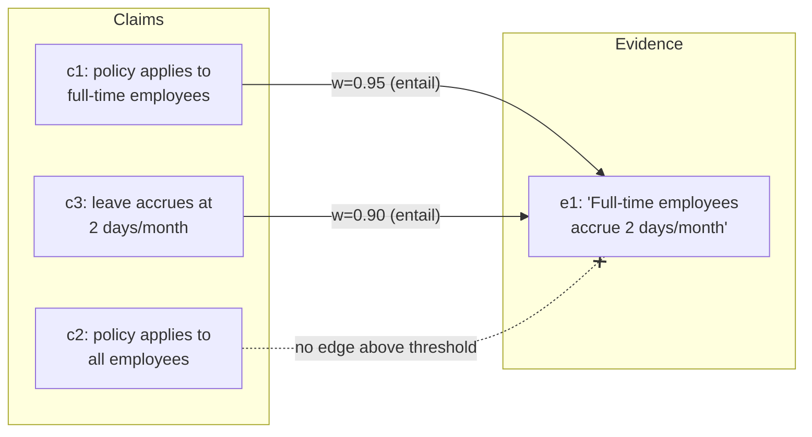

The definition of faithfulness from the last page — "for every claim, there exists an evidence passage that entails it" — is also, read the right way, an algorithm. Quantifying over two finite sets like that is exactly what a **bipartite graph** is for.

## Claims on the left, evidence on the right

Put the atomic claims on the left, the evidence passages on the right, and draw a weighted edge $w_{ij} = P(\text{entail} \mid e_j, c_i)$ wherever a verifier judges that $e_j$ supports $c_i$. This is the single most useful data structure in response-side grounding — not a diagram, but a machine with moving parts.



Now the failure we most fear becomes a *shape*:

- An **isolated left node** — a claim with no edge above threshold — is a hallucination caught; the graph doesn't merely say the answer is unfaithful, it points at the exact sentence (above, $c_2$).
- A left node with a high **contradiction** edge is worse: the evidence actively disagrees — an intrinsic hallucination.
- A **right node with no edges** is retrieved context the generator ignored — either dead weight the retriever shouldn't have fetched, or evidence that should have shaped the answer and didn't.

## The verifier: Natural Language Inference

The weights come from a verifier, and the natural one is a **Natural Language Inference (NLI)** model: given a premise (passage $e_j$) and a hypothesis (claim $c_i$), classify the pair as entailment, contradiction, or neutral. This is a narrow judgment — does this *one* passage support this *one* claim? — and narrowness is what lets a small, cheap, fast model do it well. A few-hundred-million-parameter NLI model scores dozens of claim-passage pairs in a couple hundred milliseconds on commodity hardware, no frontier model required. The bipartite graph decomposes one expensive holistic judgment ("is this answer faithful?") into many cheap local ones ("does $e_j$ entail $c_i$?").

## The algorithm

**Input:** answer $A$, evidence $E = \{e_1, \ldots, e_k\}$, threshold $\tau$.

1. **Decompose.** $C \leftarrow \text{AtomicClaims}(A)$ — a small LLM splits $A$ into single-fact sentences.
2. **Score edges.** For each $c_i \in C$ and $e_j \in E$: $w_{ij} \leftarrow P_{\text{NLI}}(\text{entail} \mid e_j, c_i)$, $\bar{w}_{ij} \leftarrow P_{\text{NLI}}(\text{contra} \mid e_j, c_i)$.
3. **Label claims.** For each $c_i$: if $\max_j w_{ij} > \tau$ → grounded; else if $\max_j \bar{w}_{ij} > \tau$ → contradicted; else → ungrounded.
4. **Score answer.** $F \leftarrow \#\{\text{grounded}\} / |C|$.
5. **Act.** Route ungrounded and contradicted claims to the remedy policy (regenerate / drop / hedge / refuse — see the citation-faithfulness page).

```python
# toy assertion-evidence bipartite graph, with a keyword-overlap NLI stand-in
def nli_entail_score(claim, passage):
    c_words, e_words = set(claim.lower().split()), set(passage.lower().split())
    return len(c_words & e_words) / len(c_words)

claims = [
    "the policy applies to full-time employees",
    "the policy applies to all employees",
    "employees may carry over ten unused days",   # not mentioned anywhere
]
evidence = ["Full-time employees accrue paid leave at two days per month."]
threshold = 0.6

labels = {}
for c in claims:
    best = max(nli_entail_score(c, e) for e in evidence)
    labels[c] = "grounded" if best > threshold else "ungrounded"

for c, label in labels.items():
    print(f"[{label}] {c}")

F = sum(1 for l in labels.values() if l == "grounded") / len(labels)
print(f"faithfulness F = {F:.2f}")
```

## The Goldilocks zone of decomposition

The step everyone underrates is decomposition, because the whole check is bounded by the quality of the atoms. Too coarse — leave a compound claim intact — and its true half entails while its invented half rides along, ungrounded but uncaught. Too aggressive — shatter "it was founded in 1998" so the "it" is amputated — and no passage entails a fragment that no longer means anything. FActScore is really a study of this Goldilocks zone: small enough to check independently, large enough to still assert something.

## From verdict to repair loop

Run the graph proactively, during generation, and you have **chain-of-verification**: draft an answer, decompose it into check-questions, verify each against the evidence, and revise before the user ever sees the first draft. The graph also makes self-healing tractable in a way a bare faithfulness score does not: for each isolated claim, the system knows exactly what is missing, so it can formulate a targeted retrieval query from the claim itself, fire it, add the returned passages to the right side of the graph, and re-score only the edges touching that claim.

> Grounding stops being a verdict and becomes a repair loop — generate, find the isolated nodes, go looking for their evidence, re-check. The graph is the compass that tells the loop where to search; without it, "go find the missing evidence" has no address.
