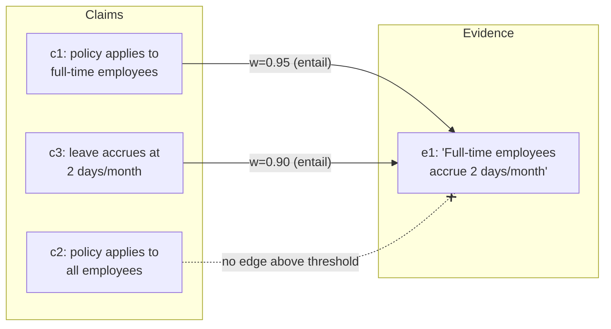

The definition of faithfulness from the last page — "for every claim, there exists an evidence passage that entails it" — is also, read the right way, an algorithm. Quantifying over two finite sets like that is exactly what a **bipartite graph** is for.

## Core intuition

A hallucination is not a vague feeling; it is a missing edge in a claim-evidence graph. Once we represent each atomic claim and each evidence passage as nodes, we can see exactly where the answer is unsupported.

## Why it matters

This graph transforms groundedness from a prose concept into a computable structure. It identifies the exact bad claim rather than merely issuing a general verdict that the answer is poor.

## Instructor framing

The "Goldilocks zone of decomposition" section is easy to skim past but is arguably the most operationally important paragraph on the page — nearly every real-world failure of a faithfulness pipeline traces back to bad decomposition, not a bad NLI model. Spend deliberate time on both failure directions (too coarse, too aggressive) with concrete sentence examples, since students who only hear "decomposition matters" in the abstract will under-invest in it exactly where the previous page warned they would.

## Worked example


Take the answer "the CEO joined in 2015 and previously led the European division, growing it into the company's largest market." Decomposed too coarsely — as one claim — an NLI check against a passage saying only "the CEO joined the company in 2015" would need to decide whether that single passage entails the whole compound sentence; it doesn't fully, so the entire claim might get marked ungrounded even though the "joined in 2015" half is perfectly supported, burying a real, verifiable fact under an invented one it happens to share a sentence with. Decomposed correctly into three atoms — "the CEO joined in 2015," "the CEO previously led the European division," "the CEO grew it into the company's largest market" — each can be checked independently: the first entails cleanly against the passage, and the graph now shows precisely which two of the three claims have no supporting evidence, rather than a single ambiguous verdict on a run-on sentence.

This is the operational form of the faithfulness definition. The graph is the proof that groundedness can be checked, localized, and repaired.

## Claims on the left, evidence on the right

Put the atomic claims on the left, the evidence passages on the right, and draw a weighted edge $w_{ij} = P(\text{entail} \mid e_j, c_i)$ wherever a verifier judges that $e_j$ supports $c_i$. This is the single most useful data structure in response-side grounding — not a diagram, but a machine with moving parts.



Now the failure we most fear becomes a *shape*:

- An **isolated left node** — a claim with no edge above threshold — is a hallucination caught; the graph doesn't merely say the answer is unfaithful, it points at the exact sentence (above, $c_2$).
- A left node with a high **contradiction** edge is worse: the evidence actively disagrees — an intrinsic hallucination.
- A **right node with no edges** is retrieved context the generator ignored — either dead weight the retriever shouldn't have fetched, or evidence that should have shaped the answer and didn't.

## The verifier: Natural Language Inference

The weights come from a verifier, and the natural one is a **Natural Language Inference (NLI)** model: given a premise (passage $e_j$) and a hypothesis (claim $c_i$), classify the pair as entailment, contradiction, or neutral. This is a narrow judgment — does this *one* passage support this *one* claim? — and narrowness is what lets a small, cheap, fast model do it well. A few-hundred-million-parameter NLI model scores dozens of claim-passage pairs in a couple hundred milliseconds on commodity hardware, no frontier model required. The bipartite graph decomposes one expensive holistic judgment ("is this answer faithful?") into many cheap local ones ("does $e_j$ entail $c_i$?").

## The algorithm

**Input:** answer $A$, evidence $E = \{e_1, \ldots, e_k\}$, threshold $\tau$.

1. **Decompose.** $C \leftarrow \text{AtomicClaims}(A)$ — a small LLM splits $A$ into single-fact sentences.
2. **Score edges.** For each $c_i \in C$ and $e_j \in E$: $w_{ij} \leftarrow P_{\text{NLI}}(\text{entail} \mid e_j, c_i)$, $\bar{w}_{ij} \leftarrow P_{\text{NLI}}(\text{contra} \mid e_j, c_i)$.
3. **Label claims.** For each $c_i$: if $\max_j w_{ij} > \tau$ → grounded; else if $\max_j \bar{w}_{ij} > \tau$ → contradicted; else → ungrounded.
4. **Score answer.** $F \leftarrow \#\{\text{grounded}\} / |C|$.
5. **Act.** Route ungrounded and contradicted claims to the remedy policy (regenerate / drop / hedge / refuse — see the citation-faithfulness page).

```python
# toy assertion-evidence bipartite graph, with a keyword-overlap NLI stand-in
def nli_entail_score(claim, passage):
    c_words, e_words = set(claim.lower().split()), set(passage.lower().split())
    return len(c_words & e_words) / len(c_words)

claims = [
    "the policy applies to full-time employees",
    "the policy applies to all employees",
    "employees may carry over ten unused days",   # not mentioned anywhere
]
evidence = ["Full-time employees accrue paid leave at two days per month."]
threshold = 0.6

labels = {}
for c in claims:
    best = max(nli_entail_score(c, e) for e in evidence)
    labels[c] = "grounded" if best > threshold else "ungrounded"

for c, label in labels.items():
    print(f"[{label}] {c}")

F = sum(1 for l in labels.values() if l == "grounded") / len(labels)
print(f"faithfulness F = {F:.2f}")
```

## The Goldilocks zone of decomposition

The step everyone underrates is decomposition, because the whole check is bounded by the quality of the atoms. Too coarse — leave a compound claim intact — and its true half entails while its invented half rides along, ungrounded but uncaught. Too aggressive — shatter "it was founded in 1998" so the "it" is amputated — and no passage entails a fragment that no longer means anything. FActScore is really a study of this Goldilocks zone: small enough to check independently, large enough to still assert something.

## From verdict to repair loop

Run the graph proactively, during generation, and you have **chain-of-verification**: draft an answer, decompose it into check-questions, verify each against the evidence, and revise before the user ever sees the first draft. The graph also makes self-healing tractable in a way a bare faithfulness score does not: for each isolated claim, the system knows exactly what is missing, so it can formulate a targeted retrieval query from the claim itself, fire it, add the returned passages to the right side of the graph, and re-score only the edges touching that claim.

> Grounding stops being a verdict and becomes a repair loop — generate, find the isolated nodes, go looking for their evidence, re-check. The graph is the compass that tells the loop where to search; without it, "go find the missing evidence" has no address.


## Math explained step by step

Walk through why building the *full* bipartite graph, rather than checking each claim against a single "best" passage, is the right design.

**Step 1 — see why every claim must be checked against every passage, not just the top-ranked one.** A claim's true supporting evidence might not be the passage the retriever ranked highest overall — the graph's edges $w_{ij}$ are computed for every $(c_i, e_j)$ pair specifically so that a claim can find its support wherever it lives among the retrieved evidence, not just in whichever passage happened to score highest against the whole query.

**Step 2 — see why taking the max over $j$, not the sum or average, is the correct aggregation.** $\max_j w_{ij} > \tau$ asks "does *any* passage support this claim?" — a claim only needs one entailing passage to be grounded, so averaging across passages (most of which are irrelevant to any given specific claim) would dilute a real, strong entailment with irrelevant near-zero scores, exactly the dilution-inequality mistake from Week 4 in a new context.

**Step 3 — see why entailment and contradiction are scored as two separate quantities, not one bipolar scale.** $w_{ij}$ (entailment) and $\bar w_{ij}$ (contradiction) both being computed lets the algorithm distinguish "no passage discusses this claim at all" (both scores low — ungrounded, an extrinsic hallucination or fabrication) from "a passage actively disagrees" (contradiction score high — an intrinsic hallucination). These call for different remedies (fetch more evidence, versus flag and likely regenerate), which is exactly the distinction the hallucination taxonomy from the previous page needs a computational hook for.

**Step 4 — see why the algorithm terminates in a repair loop rather than a single verdict.** Once an isolated (ungrounded) claim is identified, its own text is a ready-made query — "employees may carry over ten unused days" can be embedded and searched directly, since the claim states exactly what evidence is missing. This is only possible *because* the graph localizes the failure to one specific claim; a single scalar faithfulness score, by contrast, tells you the answer failed somewhere without telling the repair loop where to point its next retrieval.

## Practical pattern

Implementing the assertion-evidence graph in a production grounding pipeline:

1. invest disproportionately in the decomposition step — test your claim-splitting prompt against known-tricky sentences (compound claims, claims with embedded pronouns) before trusting it on production traffic, since decomposition quality is the ceiling on everything downstream;
2. score both entailment and contradiction for every edge, not just entailment — a contradicted claim and an ungrounded claim look identical if you only check "does this exceed the entailment threshold," but they call for different remedies;
3. use the graph's isolated-claim output to drive targeted re-retrieval (the repair loop) rather than regenerating the whole answer from scratch on any failure — this is both cheaper and more precise, since only the specific ungrounded claim needs new evidence, not the claims that already checked out;
4. log right-side (evidence) nodes with zero incoming edges as a retrieval-quality signal, separate from claim-grounding — a consistently high rate of ignored evidence across many answers suggests the retriever is fetching topically-adjacent but ultimately unused passages, a different problem from hallucination.

## Common traps

- under-investing in claim decomposition and assuming the NLI verifier is where quality comes from — a mediocre decomposer feeding a great NLI model still produces unreliable faithfulness scores, because the atoms being checked are already wrong;
- checking only entailment and treating "below threshold" as one undifferentiated failure category, missing the more urgent distinction between a merely-unsupported claim and an actively-contradicted one;
- discarding the graph structure after computing a single aggregate faithfulness score, losing the localization that makes targeted repair (rather than full regeneration) possible;
- ignoring right-side nodes with no incoming edges, missing a free diagnostic signal about retrieval quality that the graph already computed as a side effect.

## Takeaways

- The assertion-evidence bipartite graph turns "is this answer faithful" from a vague verdict into a computable structure: isolated claim nodes are hallucinations, located precisely; contradiction edges are worse, actively-disagreeing hallucinations; unused evidence nodes flag retrieval waste.
- Decomposition quality is the bottleneck on the whole pipeline — too coarse buries a real hallucination inside a partially-true compound claim, too aggressive destroys the meaning a checker needs to verify anything at all.
- Concretely: when a faithfulness score looks wrong or unstable, audit the claim-decomposition step first, before tuning the NLI or judge model — most real-world grounding failures trace back to bad atoms, not a bad verifier.
