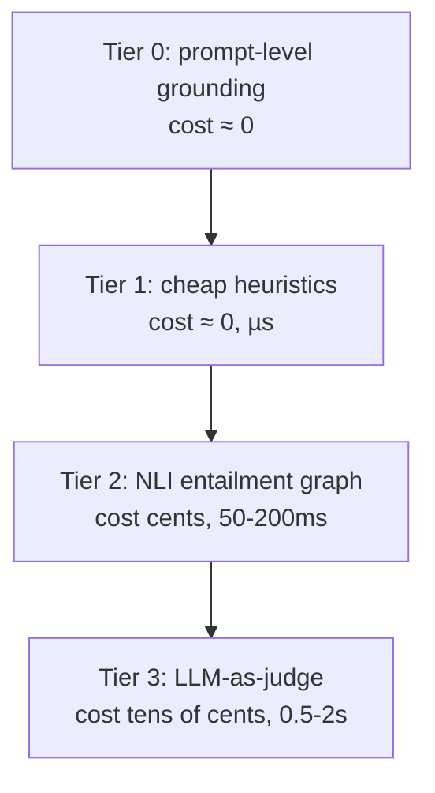

You cannot afford to LLM-judge every claim of every answer — the whole discipline of production grounding descends from that one sentence.

## Core intuition

The answer checker should be a ladder: cheap signals first, expensive reasoning only on the residue. The cost of certainty must be paid only when the system is unsure enough to need it.

## Why it matters

This is the practical economics of grounded generation. A production system survives only if its verification stack is both accurate and affordable.

## Instructor framing

The $50,000-versus-$4,300-per-day comparison is the single most persuasive number in this entire week for a skeptical engineering audience — lead with it when justifying the ladder architecture to anyone who instinctively wants to "just always use the best model for safety." Pair it explicitly with the false-positive tax from Act I: both pages are the same lesson (a well-meaning maximalist policy has real, quantifiable costs) applied to two different gates.

## Worked example


Trace one query through all four tiers. A user asks "am I eligible for the tax credit?" and the answer decomposes into two claims: "the credit applies to filers with income under $75,000" (Tier 1 checks the number "$75,000" appears somewhere in the evidence — it does, cost near zero) and "the filing deadline is in April" (Tier 2's NLI model compares this against the retrieved passage "returns are due the fifteenth of April" and, reading premise and hypothesis as separate sentences without bridging inference, scores the entailment ambiguously — below threshold, not confidently grounded). This claim escalates to Tier 3: the LLM judge, reasoning over the whole context rather than one passage at a time, recognizes that "due the fifteenth of April" straightforwardly entails "in April" and marks it grounded. Only this one claim, out of the whole day's traffic touching this exact phrasing pattern, needed the expensive tier — the other claim settled at Tier 1, for free.

We are now turning the faithfulness check into a system design problem. The question is not what verifier is best in the abstract, but which verifiers are worth running at which stage.

## The two verifiers

The NLI model from the last page is the **cheap verifier**. The **expensive** one is an LLM itself, reading the whole answer against the whole evidence and rendering a holistic verdict.

The LLM-as-judge is genuinely more capable on the hard cases — conditional claims ("this applies only to filers over sixty-five"), hedged assertions, and implicit contradictions no single premise sentence entails or refutes — because it reasons over the gestalt rather than one passage at a time. For example, NLI sometimes fails to see that "the filing deadline is in April" is entailed by "returns are due the fifteenth of April" — a bridge the judge builds easily.

But the judge has a conscience problem of its own, with three documented pathologies:

| Pathology | What happens |
|---|---|
| **Self-preference** | judges systematically favor text resembling their own generations — on the order of a ten-point win-rate inflation for a model grading its own work |
| **Verbosity bias** | judges reward length, scoring a longer answer as more thorough even when the added length is unsupported padding — a dangerous alignment with the direction hallucination pushes |
| **Position bias** | in pairwise verdicts, the judgment flips when you swap the order of the two candidates in **10-30%** of cases — not reconsideration, a standing preference for a slot |

> A biased judge is a conscience with its thumb on the scale. Keep the judge's task narrow and evidential — "is $c_i$ entailed by $e_j$?" — not "is this a good answer?", which invites every bias to grab hold.

## Why they're a cascade, not rivals

Weigh them as a precision-recall trade. **NLI is cheap and high-recall**: it flags anything that doesn't clearly entail, catching nearly every real hallucination but also firing on valid paraphrases and cross-passage inferences — false positives that annoy. **The LLM judge is expensive and higher-precision**: it builds bridges NLI misses. Use the cheap high-recall model to clear the obviously grounded majority, and spend the expensive high-precision model only on the residue the cheap one could not settle.

## The escalation ladder

Four tiers, cheapest first:



- **Tier 0 — prompt-level grounding** (cost ≈ 0): instruct the generator to answer only from context, cite each claim, and say "I don't have enough information" when silent. Not a guardrail in the engineering sense — a polite request the model may ignore — but free, and removes a surprising share of casual hallucination. It also sets the *grounding strictness*: strict for legal/medical, augmented-knowledge for internal tools, synthesis for research assistants.
- **Tier 1 — cheap heuristics** (cost ≈ 0, µs): format and lexical checks needing no model. Are cited passage identifiers real? Does every sentence marked with a citation actually carry one? Does every number in the answer appear somewhere in the evidence? A number appearing in no passage is a near-certain fabrication, catchable by string search.
- **Tier 2 — NLI entailment** (cents, 50-200 ms): the bipartite graph, run on every answer that survives Tiers 0-1. High recall, low cost — this tier does the bulk of the work.
- **Tier 3 — LLM-as-judge** (tens of cents, 0.5-2 s): reserved for the residue — claims NLI marked borderline, high-stakes answers, and a random audit sample for drift monitoring.

## The economics

Let $\rho_t$ be the fraction of answers reaching tier $t$, at cost $\kappa_t$ per answer ($\rho_0 = 1 \geq \rho_1 \geq \rho_2 \geq \rho_3$). The expected per-answer verification cost:

$$\mathbb{E}[\text{cost}] = \sum_t \rho_t \kappa_t$$

A tier earns its place iff the expected loss it prevents exceeds $\rho_t \kappa_t$, the cost it adds. Tier 3's $\kappa_3$ is large, so it survives the calculus only because a well-built ladder drives $\rho_3$ into single digits.

**Worked example.** A service answers one million queries a day. Every answer pays Tiers 0-1 for free. Suppose $\rho_2 = 0.9$ of answers reach NLI at $\kappa_2 = \$0.002$, and $\rho_3 = 0.05$ escalate to the judge at $\kappa_3 = \$0.05$:

$$\mathbb{E}[\text{cost}] = 0.9 \times 0.002 + 0.05 \times 0.05 = 0.0018 + 0.0025 = \$0.0043 \text{ per answer}$$

About **\$4,300 a day**. Now let a well-meaning architect run the judge on *every* answer "for maximum safety" ($\rho_3 = 1$): the judge term alone becomes \$0.05 per answer — **\$50,000 a day**, a more-than-tenfold increase to catch the marginal hallucination the ladder already caught for a fraction of the price.

```python
# the economics of the escalation ladder
queries_per_day = 1_000_000

def expected_cost(rho2, kappa2, rho3, kappa3):
    return rho2 * kappa2 + rho3 * kappa3

ladder_cost = expected_cost(rho2=0.9, kappa2=0.002, rho3=0.05, kappa3=0.05)
blanket_judge_cost = expected_cost(rho2=0.9, kappa2=0.002, rho3=1.0, kappa3=0.05)

print(f"well-built ladder: ${ladder_cost * queries_per_day:,.0f}/day")
print(f"judge on everything: ${blanket_judge_cost * queries_per_day:,.0f}/day")
```

> In any generate-and-check system — a coding agent checked by tests, a RAG answer checked by a grounding verifier — the ceiling on quality is set not by the generator but by the checker. The ladder is how we buy the most verifier accuracy per dollar: cheap recall to clear the field, expensive precision to settle the residue.


## Math explained step by step

Rebuild the $4,300-versus-$50,000 comparison from its formula, then generalize the lesson about tier design.

**Step 1 — write the expected cost as a sum over tiers.** $\mathbb{E}[\text{cost}] = \sum_t \rho_t \kappa_t$: each tier contributes its own cost $\kappa_t$, weighted by $\rho_t$, the fraction of traffic that actually reaches it. Tiers 0-1 are free, so they contribute nothing to this sum regardless of how much traffic passes through — cost only starts accruing at Tier 2.

**Step 2 — plug in the well-built ladder's numbers.** $\rho_2 = 0.9$ (90% of answers reach NLI checking) at $\kappa_2 = \$0.002$ contributes $0.9 \times 0.002 = \$0.0018$. $\rho_3 = 0.05$ (only 5% escalate to the judge) at $\kappa_3 = \$0.05$ contributes $0.05 \times 0.05 = \$0.0025$. Summing: $\$0.0018 + \$0.0025 = \$0.0043$ per answer, or $\$4,300$/day at a million queries.

**Step 3 — see exactly what changes when $\rho_3 \to 1$.** Holding Tier 2's contribution fixed at $\$0.0018$ (NLI still runs on 90% of traffic regardless), the Tier 3 term becomes $1.0 \times 0.05 = \$0.05$ — the judge's cost is now the *dominant* term by more than an order of magnitude, since it no longer benefits from any filtering. Total: $\$0.0018 + \$0.05 = \$0.0518$ per answer, or roughly $\$51,800$/day — matching the reported "more than tenfold increase."

**Step 4 — see the general design principle this reveals.** The Tier 3 term's contribution is literally the product $\rho_3 \kappa_3$ — since $\kappa_3$ is fixed by the choice of judge model, the *only* lever available for controlling this term's cost is $\rho_3$, the fraction of traffic reaching it. This is why "a tier earns its place iff the expected loss it prevents exceeds $\rho_t \kappa_t$" is the right test: it makes explicit that an expensive tier's economic viability depends entirely on how well the *earlier* tiers filter traffic before it, not on the expensive tier's own accuracy in isolation.

## Practical pattern

Designing and operating a verification ladder for a real system:

1. measure your own $\rho_t$ values empirically on a representative traffic sample before estimating costs — the 90%/5% split here is illustrative, and your actual escalation rates depend on your domain's claim complexity and your Tier 1-2 checks' precision;
2. treat a rising $\rho_3$ (more traffic reaching the expensive judge tier) as a signal to improve Tier 2, not just as a cost to accept — since $\rho_3$ is the main lever on total cost, investing in better NLI models or better decomposition (previous page) to resolve more cases at Tier 2 pays for itself directly in reduced judge-tier spend;
3. keep the LLM judge's task narrow ("is $c_i$ entailed by $e_j$?") rather than holistic ("is this a good answer?") specifically to sidestep the documented biases (self-preference, verbosity, position) — a narrow evidential task gives those biases much less surface area to operate on;
4. reserve a small, fixed slice of Tier 3 capacity for random audit sampling regardless of whether Tier 2 flagged anything — this is the only way to detect drift in Tier 2's own accuracy over time, since a silently-degrading cheap tier would otherwise just quietly pass more bad answers with no signal that anything changed.

## Common traps

- responding to any grounding failure by making the entire ladder more conservative (routing more traffic to Tier 3) rather than diagnosing whether the failure was a Tier 2 miss that better decomposition or a better NLI model could have caught for a fraction of the cost;
- deploying an LLM judge with a broad, holistic task ("evaluate this answer's quality") rather than a narrow evidential one, unknowingly inviting the exact self-preference, verbosity, and position biases documented for this use case;
- estimating ladder costs from someone else's published $\rho_t$ figures rather than measuring your own traffic's actual escalation rates, which depend heavily on domain-specific claim complexity;
- treating "the judge is more accurate" as justification for running it on all traffic, without weighing that accuracy gain against the often order-of-magnitude cost difference the tier-weighted formula makes explicit.

## Takeaways

- Expected verification cost is $\sum_t \rho_t \kappa_t$ — since expensive tiers have fixed per-use cost $\kappa_t$, the only real lever for controlling total spend is $\rho_t$, how much traffic reaches them, which is entirely a function of how well earlier, cheaper tiers filter first.
- Running the most accurate verifier (an LLM judge) on all traffic "for maximum safety" is not the safest design in practice — it multiplies cost by an order of magnitude to catch marginal cases a well-tuned cheaper tier already resolves.
- Concretely: measure your own tier-escalation rates before estimating costs, and treat a rising expensive-tier escalation rate as a signal to invest in improving the cheaper tier ahead of it, not merely as an unavoidable cost to accept.
