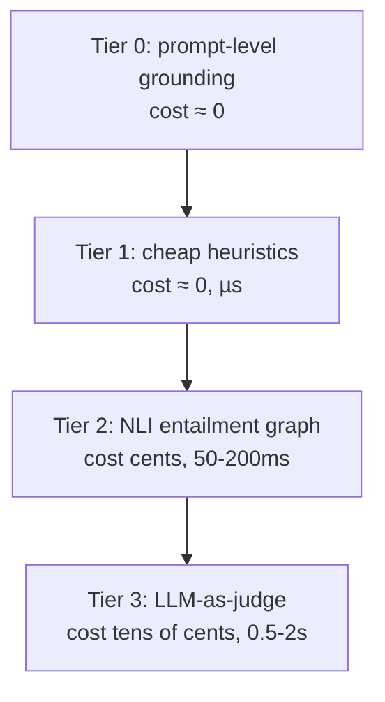

You cannot afford to LLM-judge every claim of every answer — the whole discipline of production grounding descends from that one sentence.

## The two verifiers

The NLI model from the last page is the **cheap verifier**. The **expensive** one is an LLM itself, reading the whole answer against the whole evidence and rendering a holistic verdict.

The LLM-as-judge is genuinely more capable on the hard cases — conditional claims ("this applies only to filers over sixty-five"), hedged assertions, and implicit contradictions no single premise sentence entails or refutes — because it reasons over the gestalt rather than one passage at a time. For example, NLI sometimes fails to see that "the filing deadline is in April" is entailed by "returns are due the fifteenth of April" — a bridge the judge builds easily.

But the judge has a conscience problem of its own, with three documented pathologies:

| Pathology | What happens |
|---|---|
| **Self-preference** | judges systematically favor text resembling their own generations — on the order of a ten-point win-rate inflation for a model grading its own work |
| **Verbosity bias** | judges reward length, scoring a longer answer as more thorough even when the added length is unsupported padding — a dangerous alignment with the direction hallucination pushes |
| **Position bias** | in pairwise verdicts, the judgment flips when you swap the order of the two candidates in **10-30%** of cases — not reconsideration, a standing preference for a slot |

> A biased judge is a conscience with its thumb on the scale. Keep the judge's task narrow and evidential — "is $c_i$ entailed by $e_j$?" — not "is this a good answer?", which invites every bias to grab hold.

## Why they're a cascade, not rivals

Weigh them as a precision-recall trade. **NLI is cheap and high-recall**: it flags anything that doesn't clearly entail, catching nearly every real hallucination but also firing on valid paraphrases and cross-passage inferences — false positives that annoy. **The LLM judge is expensive and higher-precision**: it builds bridges NLI misses. Use the cheap high-recall model to clear the obviously grounded majority, and spend the expensive high-precision model only on the residue the cheap one could not settle.

## The escalation ladder

Four tiers, cheapest first:



- **Tier 0 — prompt-level grounding** (cost ≈ 0): instruct the generator to answer only from context, cite each claim, and say "I don't have enough information" when silent. Not a guardrail in the engineering sense — a polite request the model may ignore — but free, and removes a surprising share of casual hallucination. It also sets the *grounding strictness*: strict for legal/medical, augmented-knowledge for internal tools, synthesis for research assistants.
- **Tier 1 — cheap heuristics** (cost ≈ 0, µs): format and lexical checks needing no model. Are cited passage identifiers real? Does every sentence marked with a citation actually carry one? Does every number in the answer appear somewhere in the evidence? A number appearing in no passage is a near-certain fabrication, catchable by string search.
- **Tier 2 — NLI entailment** (cents, 50-200 ms): the bipartite graph, run on every answer that survives Tiers 0-1. High recall, low cost — this tier does the bulk of the work.
- **Tier 3 — LLM-as-judge** (tens of cents, 0.5-2 s): reserved for the residue — claims NLI marked borderline, high-stakes answers, and a random audit sample for drift monitoring.

## The economics

Let $\rho_t$ be the fraction of answers reaching tier $t$, at cost $\kappa_t$ per answer ($\rho_0 = 1 \geq \rho_1 \geq \rho_2 \geq \rho_3$). The expected per-answer verification cost:

$$\mathbb{E}[\text{cost}] = \sum_t \rho_t \kappa_t$$

A tier earns its place iff the expected loss it prevents exceeds $\rho_t \kappa_t$, the cost it adds. Tier 3's $\kappa_3$ is large, so it survives the calculus only because a well-built ladder drives $\rho_3$ into single digits.

**Worked example.** A service answers one million queries a day. Every answer pays Tiers 0-1 for free. Suppose $\rho_2 = 0.9$ of answers reach NLI at $\kappa_2 = \$0.002$, and $\rho_3 = 0.05$ escalate to the judge at $\kappa_3 = \$0.05$:

$$\mathbb{E}[\text{cost}] = 0.9 \times 0.002 + 0.05 \times 0.05 = 0.0018 + 0.0025 = \$0.0043 \text{ per answer}$$

About **\$4,300 a day**. Now let a well-meaning architect run the judge on *every* answer "for maximum safety" ($\rho_3 = 1$): the judge term alone becomes \$0.05 per answer — **\$50,000 a day**, a more-than-tenfold increase to catch the marginal hallucination the ladder already caught for a fraction of the price.

```python
# the economics of the escalation ladder
queries_per_day = 1_000_000

def expected_cost(rho2, kappa2, rho3, kappa3):
    return rho2 * kappa2 + rho3 * kappa3

ladder_cost = expected_cost(rho2=0.9, kappa2=0.002, rho3=0.05, kappa3=0.05)
blanket_judge_cost = expected_cost(rho2=0.9, kappa2=0.002, rho3=1.0, kappa3=0.05)

print(f"well-built ladder: ${ladder_cost * queries_per_day:,.0f}/day")
print(f"judge on everything: ${blanket_judge_cost * queries_per_day:,.0f}/day")
```

> In any generate-and-check system — a coding agent checked by tests, a RAG answer checked by a grounding verifier — the ceiling on quality is set not by the generator but by the checker. The ladder is how we buy the most verifier accuracy per dollar: cheap recall to clear the field, expensive precision to settle the residue.
