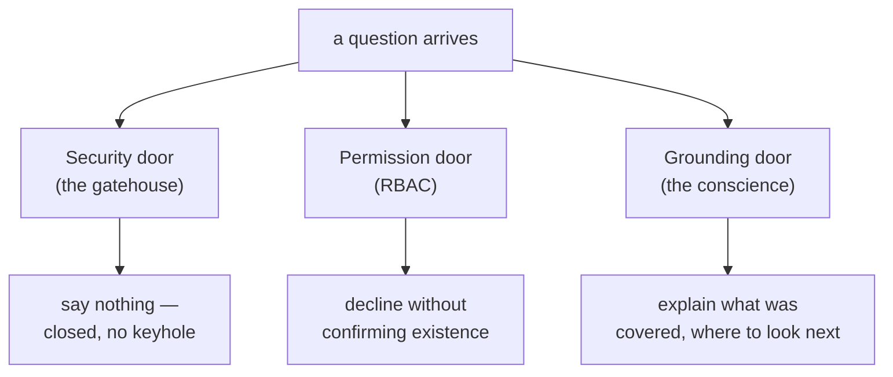

There is a move a system can make that is neither a good answer nor a caught mistake: sometimes the honest output is no output at all. The retrieval came back thin; the question sits on the far side of a permission boundary; the stakes are a medical dose and the evidence is a forum post. In those moments, the disciplined thing — the thing that separates a trustworthy system from Oz — is to decline, clearly, helpfully, and without shame.

> Refusal is a competence, not a failure mode to be minimized toward zero. A system that never refuses is not maximally helpful; it is maximally credulous.

## Refusal needs engineering seriousness

A product dashboard that counts refusals and drives the number toward zero is optimizing for the wrong thing — it can't tell a *cowardly* refusal (declining a perfectly answerable question out of miscalibrated caution) from a *principled* one. The right target for the refusal rate is not zero and not one, but **calibrated**: refuse exactly the questions you ought to refuse. To earn that, refusal needs a trigger (what conditions justify declining), a surface (what the user actually sees), and a ledger entry (a logged, auditable record of why).

## The three doors

Not all refusals are the same refusal, and conflating them is how teams build one blunt "I can't help" that serves none of the three cases well.

| Door | Trigger | How much it may explain |
|---|---|---|
| **Security** | the request itself is hostile — a jailbreak, an injection, a system-prompt extraction attempt | nothing at all; every word of explanation is reconnaissance for the adversary |
| **Permission** | the question is legitimate but the asker isn't cleared for the documents that would answer it | decline without confirming existence — "there is no such document" and "you may not see that document" are different sentences, and the difference itself leaks whether the document exists |
| **Grounding** | the question is legitimate, the asker is cleared, but the system cannot support an answer from the evidence it retrieved | stand wide open: say what it covered, what it's silent on, and where to look next |

> How much a refusal may explain itself is a security decision, not a copywriting decision. A team that ships one refusal template for all three either leaks information at the first two doors or builds a uselessly-terse wall at the third.

A good refusal, whichever door, is a **redirect, not a wall**: it names the boundary, preserves the user's agency (here are the sources; here is who to ask), and leaves a path forward (rephrase, narrow scope, request access). A graceful refusal costs more per token than a bare wall — it must assemble what was covered and which sources to surface — and it's worth every token, because the alternative isn't a cheaper refusal but a confident hallucination, the most expensive output a RAG system can produce. Over-refusal is a real, measured cost too — a system that declines the benign question fails its users as surely as one that answers the hostile question fails its owners, a failure benchmarks like XSTest exist to measure; R-Tuning is the complementary discipline of teaching a model to say "I don't know" when, and only when, it should.

## Refusal is binary; humility is graded

This is the crux the whole Act walks toward. **Refusal** is binary — answer or decline, a door open or shut — and it's a **values/scope** decision: we decline the political question ("which party should our PAC fund this cycle?") not because we cannot answer it but because we choose not to.

But most real questions don't deserve a binary. Retrieval usually grounds *some* of the answer and is silent on the rest, and a system with only two settings — confident answer or flat refusal — is forced to round every partial case to an extreme. Round up and it hallucinates the ungrounded remainder; round down and it refuses a question it could have half-answered honestly. **Humility** is the graded escape, and it's **epistemic**, not values-based: precision about how much the system actually knows.

Consider: *"What is our parental-leave policy for a contractor in Germany, and how does it interact with statutory leave?"* The corpus may hold the contractor policy in full, mention German statutory leave only in passing, and say nothing about the interaction. A binary system answers the whole thing (and fabricates the interaction) or refuses the whole thing (wasting the two-thirds it could support). A humble system does neither: it answers the contractor policy with citations, marks the statutory-leave clause as partially supported, and explicitly flags the interaction as not covered — turning one opaque answer into a map of its own grounding. Every sentence carries one of three labels:

- **grounded** — the documents say this
- **inferred** — they imply this, and the system is telling you it's an inference
- **unknown** — they are silent, and the system is telling you that too

> If refusal is the system's integrity, humility is its precision about its own integrity — not merely whether it knows, but how much, and the discipline to say so in the same breath as the answer.
