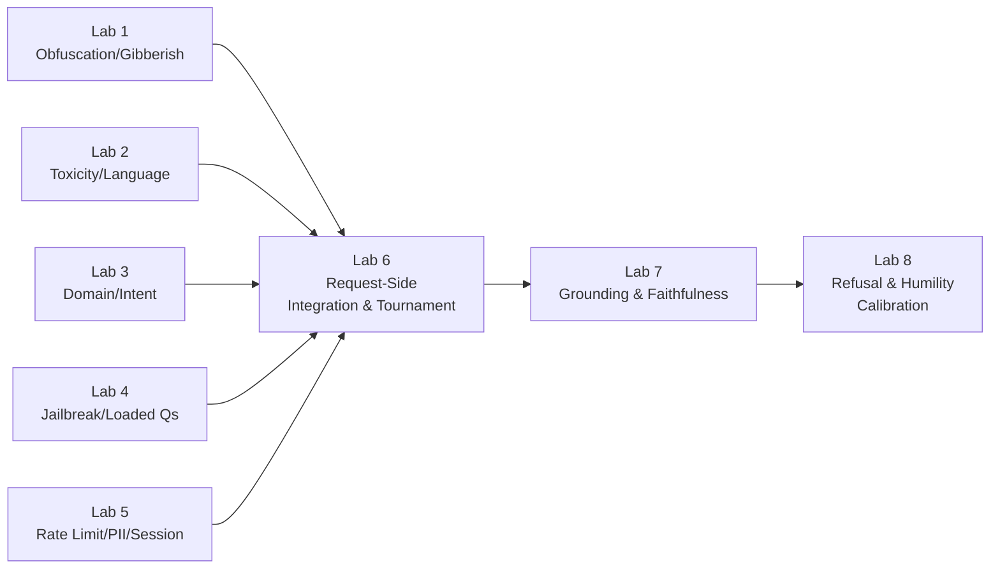

Everything in Acts I through III was intuition; the labs are where it becomes an artifact you can deploy in front of last week's RAG system. The through-line of every lab is the same demand: not only build the detector, but **measure it**, on a dataset that mixes the attack you're defending against with the legitimate traffic you must not turn away.

> A guardrail without a precision-recall number beside it is a guardrail you are trusting on faith — precisely the sin the whole week teaches you to refuse.

Eight labs, front to back through the two gates.

## Building the gatehouse (Labs 1–6)

| Lab | Builds | Measures |
|---|---|---|
| **1. Obfuscation and Gibberish Detection** | NFKC normalization, zero-width-character stripping, base64/hex/URL detect-and-decode (re-fed through the pipeline), and the full gibberish ladder (hash-set → character statistics → entropy/OOV rate → small distilled classifier) | precision, recall, and latency **per rung** on legitimate queries, keyboard smashes, encoded payloads, and gradient-optimized adversarial suffixes — watching most gibberish die at rung one for microseconds |
| **2. Toxicity and Language Detection** | Detoxify (or equivalent), calibrated on a set that deliberately includes hard edge cases like the "hate-speech policy" question; fastText language ID; a self-staged translation jailbreak (English-refused prompts translated into three low-resource languages) | toxicity precision/recall across a sweep of thresholds (the full operating curve, not one magic number); language-ID accuracy; detection rate before/after the language guardrail |
| **3. Domain and Intent Classification** | a fine-tuned ModernBERT (or DistilBERT) for binary in/out-of-domain detection, extended to multi-class intent (factual lookup, comparison, summarization, synthesis, procedural, chitchat) with carefully curated out-of-domain negatives | accuracy, per-class F1, and the rejection rate on legitimate edge-case queries — the number that matters most for the false-positive tax |
| **4. Jailbreak Detection and Loaded Questions** | a pattern-matching first pass for known jailbreak phrases; a perplexity-based detector for GCG-style suffixes (cooperating with, not competing against, the gibberish ladder); a presupposition extractor plus NLI check for loaded questions, with a reframing response instead of a flat refusal | detection rate, false-positive rate, and latency against a curated jailbreak set (HackAPrompt or internal red-team data) — honest testing shows the best single classifier stopping only about two-thirds of attacks |
| **5. Rate Limiting, PII, and Session-Level Guardrails** | a per-user/per-session rate limiter (clean 429 + Retry-After); a PII detect-and-redact pass (structured-secret regexes plus Presidio NER); exact-match and embedding-based near-duplicate detection over a sliding window; a multi-turn abuse detector tracking session embedding centroid and sensitivity derivative | PII recall on synthetic data; false-positive rate on legitimate queries that merely contain numbers; the multi-turn detector's sensitivity to different escalation speeds, tested against a simulated 5-10 turn Crescendo |
| **6. Request-Side Integration and the Guardrail Tournament** | every request-side stage wired into one ordered funnel, run in front of last week's RAG system | end-to-end latency against the sub-hundred-millisecond budget; an **ablation tournament table** — remove each gate in turn, measure the safety and usability impact — where the false-positive tax stops being arithmetic and becomes a lived observation (roughly one legitimate query in six turned away by a sixteen-gate stack) |

## Building the conscience and the honest no (Labs 7–8)

| Lab | Builds | Measures |
|---|---|---|
| **7. Response-Side Grounding and Faithfulness Measurement** | the assertion-evidence bipartite graph end to end (LLM decomposer, NLI verifier, the labeling rule reading a hallucination off an isolated left node); the full RAGAS triad; the two-verifier cascade (cheap NLI clearing the majority, expensive judge on the residue), with the judge's own position/verbosity/self-preference biases deliberately provoked by swapping candidate order and padding length | faithfulness against a labeled set of grounded and hallucinated answers; cost per answer as a function of how much traffic escalates to the judge |
| **8. Refusal and Humility Calibration** | the three doors of refusal with three genuinely different surfaces (security: nothing; permission: decline without confirming existence; grounding: explain fully); verbalized-uncertainty templates tied to real signals (retrieval thinness, groundedness residue, sample consistency) rather than the model's self-report; a conformal abstention threshold fit at a chosen $\alpha$ | empirical coverage of the conformal guarantee on a held-out set; the reliability diagram and expected calibration error before and after; how the abstention threshold moves as the domain's cost asymmetry varies |

Labs 2 and 3 together stage the prettiest result of Act I inside the lab itself: the domain gate silently absorbs most off-topic toxicity for free, while the dedicated toxicity layer catches the in-domain slur the domain gate waves through. Ablate either one and watch the other fail to cover its blind spot — Swiss cheese observed, not asserted. And Lab 7 is the exit gate's Lab 1: the bipartite graph is to the conscience what deobfuscation is to the gatehouse — the load-bearing structure everything else (refusal, humility, citation-checking) stands on, read through different lenses.
