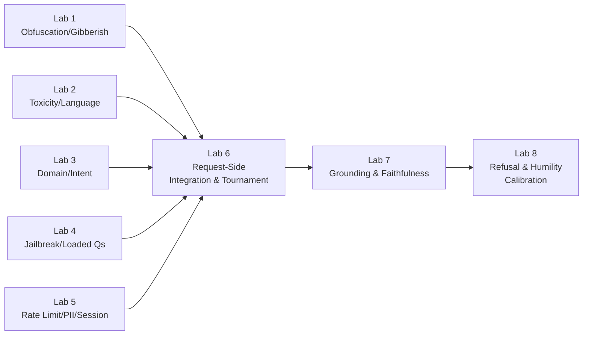

Everything in Acts I through III was intuition; the labs are where it becomes an artifact you can deploy in front of last week's RAG system. The through-line of every lab is the same demand: not only build the detector, but **measure it**, on a dataset that mixes the attack you're defending against with the legitimate traffic you must not turn away.

> A guardrail without a precision-recall number beside it is a guardrail you are trusting on faith — precisely the sin the whole week teaches you to refuse.

## Core intuition

The real value of a guardrail is not in the slogan attached to it but in how it performs under real traffic. Measurement converts a design into a product.

## Why it matters

This is the closing lesson: every layer of safety must be evaluated on both malicious and benign examples, because their failures are not symmetric.

## Instructor framing

Students walk in wanting to build the cleverest single detector. Redirect that energy toward the ablation tables in Labs 6 and 7 instead — the point of eight labs is not eight isolated demos, it's learning to read a table that says "remove this gate and watch what breaks," because that table is the only evidence a stakeholder should ever accept for "this system is safe."

## Worked example

Trace one query, "What's the warranty policy for water damage?", through the full stack. Lab 1's gibberish ladder clears it in microseconds (real English, no obfuscation). Lab 2 finds no toxicity and confirms the language. Lab 3's domain classifier accepts it as in-domain, factual-lookup intent. Lab 4 finds no jailbreak pattern. Lab 5 checks it isn't a duplicate flood and passes it through. It reaches the RAG system, which retrieves a warranty clause and drafts an answer. Lab 7's bipartite graph decomposes the answer into claims and verifies each against the retrieved clause — all ground. Lab 8 computes retrieval thinness and groundedness residue, both comfortably low, and the hedge selector returns "The sources directly state…" Now run the *same* query with one word changed — "does the warranty cover damage from a *war*?" — a policy exclusion nowhere in the corpus. Retrieval comes back thin, groundedness residue spikes, and Lab 8's conformal threshold routes it to abstain rather than confabulate an answer. Same eight labs, same pipeline, two different fates — because each stage measured something real rather than assuming the query was fine.

Eight labs, front to back through the two gates.

## Building the gatehouse (Labs 1–6)

| Lab | Builds | Measures |
|---|---|---|
| **1. Obfuscation and Gibberish Detection** | NFKC normalization, zero-width-character stripping, base64/hex/URL detect-and-decode (re-fed through the pipeline), and the full gibberish ladder (hash-set → character statistics → entropy/OOV rate → small distilled classifier) | precision, recall, and latency **per rung** on legitimate queries, keyboard smashes, encoded payloads, and gradient-optimized adversarial suffixes — watching most gibberish die at rung one for microseconds |
| **2. Toxicity and Language Detection** | Detoxify (or equivalent), calibrated on a set that deliberately includes hard edge cases like the "hate-speech policy" question; fastText language ID; a self-staged translation jailbreak (English-refused prompts translated into three low-resource languages) | toxicity precision/recall across a sweep of thresholds (the full operating curve, not one magic number); language-ID accuracy; detection rate before/after the language guardrail |
| **3. Domain and Intent Classification** | a fine-tuned ModernBERT (or DistilBERT) for binary in/out-of-domain detection, extended to multi-class intent (factual lookup, comparison, summarization, synthesis, procedural, chitchat) with carefully curated out-of-domain negatives | accuracy, per-class F1, and the rejection rate on legitimate edge-case queries — the number that matters most for the false-positive tax |
| **4. Jailbreak Detection and Loaded Questions** | a pattern-matching first pass for known jailbreak phrases; a perplexity-based detector for GCG-style suffixes (cooperating with, not competing against, the gibberish ladder); a presupposition extractor plus NLI check for loaded questions, with a reframing response instead of a flat refusal | detection rate, false-positive rate, and latency against a curated jailbreak set (HackAPrompt or internal red-team data) — honest testing shows the best single classifier stopping only about two-thirds of attacks |
| **5. Rate Limiting, PII, and Session-Level Guardrails** | a per-user/per-session rate limiter (clean 429 + Retry-After); a PII detect-and-redact pass (structured-secret regexes plus Presidio NER); exact-match and embedding-based near-duplicate detection over a sliding window; a multi-turn abuse detector tracking session embedding centroid and sensitivity derivative | PII recall on synthetic data; false-positive rate on legitimate queries that merely contain numbers; the multi-turn detector's sensitivity to different escalation speeds, tested against a simulated 5-10 turn Crescendo |
| **6. Request-Side Integration and the Guardrail Tournament** | every request-side stage wired into one ordered funnel, run in front of last week's RAG system | end-to-end latency against the sub-hundred-millisecond budget; an **ablation tournament table** — remove each gate in turn, measure the safety and usability impact — where the false-positive tax stops being arithmetic and becomes a lived observation (roughly one legitimate query in six turned away by a sixteen-gate stack) |

## Building the conscience and the honest no (Labs 7–8)

| Lab | Builds | Measures |
|---|---|---|
| **7. Response-Side Grounding and Faithfulness Measurement** | the assertion-evidence bipartite graph end to end (LLM decomposer, NLI verifier, the labeling rule reading a hallucination off an isolated left node); the full RAGAS triad; the two-verifier cascade (cheap NLI clearing the majority, expensive judge on the residue), with the judge's own position/verbosity/self-preference biases deliberately provoked by swapping candidate order and padding length | faithfulness against a labeled set of grounded and hallucinated answers; cost per answer as a function of how much traffic escalates to the judge |
| **8. Refusal and Humility Calibration** | the three doors of refusal with three genuinely different surfaces (security: nothing; permission: decline without confirming existence; grounding: explain fully); verbalized-uncertainty templates tied to real signals (retrieval thinness, groundedness residue, sample consistency) rather than the model's self-report; a conformal abstention threshold fit at a chosen $\alpha$ | empirical coverage of the conformal guarantee on a held-out set; the reliability diagram and expected calibration error before and after; how the abstention threshold moves as the domain's cost asymmetry varies |

Labs 2 and 3 together stage the prettiest result of Act I inside the lab itself: the domain gate silently absorbs most off-topic toxicity for free, while the dedicated toxicity layer catches the in-domain slur the domain gate waves through. Ablate either one and watch the other fail to cover its blind spot — Swiss cheese observed, not asserted. And Lab 7 is the exit gate's Lab 1: the bipartite graph is to the conscience what deobfuscation is to the gatehouse — the load-bearing structure everything else (refusal, humility, citation-checking) stands on, read through different lenses.

## Math explained step by step

Derive Lab 6's headline number — "roughly one legitimate query in six turned away by a sixteen-gate stack" — from the per-gate rates, so it reads as arithmetic rather than a scary-sounding anecdote.

**Step 1 — a query survives the stack only if it clears every gate.** If each of the 16 gates independently has some small false-positive rate $p$ (the chance it wrongly rejects a legitimate query), the probability a legitimate query clears *all* of them is $(1-p)^{16}$ — probabilities of independent events to pass multiply, so sixteen small individual risks compound multiplicatively, not additively.

**Step 2 — solve for the per-gate rate implied by the headline number.** "One in six turned away" means survival probability $\approx 5/6$. Setting $(1-p)^{16} = 5/6$ and solving: $1-p = (5/6)^{1/16} \approx 0.9887$, so $p \approx 0.0113$ — barely over a **1% false-positive rate on any single gate** compounds to a **1-in-6 rejection rate** across the full stack.

**Step 3 — see why this is the ablation table's whole point.** A gate owner who benchmarks their gate in isolation and sees "99% accuracy" is reporting a number that sounds excellent and is *consistent with* rejecting one legitimate user in six once deployed alongside fifteen siblings. The stack-level number is not visible from any single gate's own evaluation — it only appears when Lab 6 measures the assembled pipeline, which is exactly why "ablate each gate and watch the impact" is the required deliverable, not a single gate's precision/recall in isolation.

**Step 4 — connect this to Lab 8's asymmetric fix.** The false-positive tax compounds because every gate is tuned defensively (low $p$ still adds up across 16 stages). Lab 8's conformal threshold is the one stage in the stack explicitly tuned against a *stated* $\alpha$ rather than an ad hoc "make it strict" instinct — the same compounding math applies there too, which is why $\alpha$ is chosen from the domain's cost asymmetry rather than set reflexively low.

## Practical pattern

Running the eight labs as one coherent evaluation, not eight disconnected exercises:

1. build every lab's test set to include both the attack/failure case *and* a representative sample of legitimate traffic — a lab that only tests attacks can report perfect recall while silently taxing every real user;
2. carry the same precision/recall/latency reporting format across all eight labs so Lab 6's and Lab 7's ablation tables are directly comparable to each individual gate's standalone numbers;
3. treat Lab 6's ablation tournament as the acceptance test for the whole request-side stack — a stakeholder should see "remove gate X, here's what breaks," not a list of eight independently-passing unit tests;
4. re-run the full battery whenever any single gate's model, threshold, or training data changes — the compounding arithmetic in Step 2 means a small drift in one gate's false-positive rate moves the whole stack's user-facing rejection rate more than intuition suggests.

## Common traps

- reporting each lab's accuracy in isolation and never measuring the assembled stack — a set of gates that each look excellent alone can still reject a large fraction of legitimate traffic once composed, exactly as Step 2's arithmetic shows;
- testing only against attacks and never against legitimate edge cases, which hides the false-positive tax until real users start complaining;
- treating the eight labs as a checklist to complete rather than a single measured system — the value is in the ablation tables (Labs 6 and 7), not in eight passing demos;
- skipping the coverage/calibration check in Lab 8 after changing anything upstream — a retriever or model change shifts the residue distribution, and an unrefreshed conformal threshold silently stops delivering its stated guarantee.

## Takeaways

- Every guardrail's number that matters is not its standalone precision or recall, but its measured effect on the assembled stack — small per-gate false-positive rates compound multiplicatively across many gates into a large user-facing rejection rate.
- Concretely: a stack of sixteen gates each with a ~1% false-positive rate rejects roughly one legitimate query in six — always test the ablation, not just the individual gate.
- The eight labs are one measured system, not eight demos: build each test set with both attacks and legitimate traffic, and re-run the full battery whenever any upstream gate changes.
